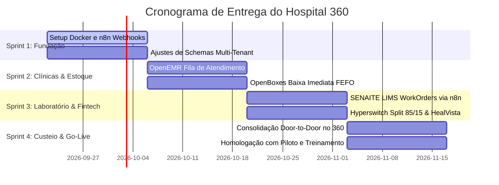

# HOSPITAL 360 — BLUEPRINT DE TRANSIÇÃO ARQUITETURAL
## Guia do Líder Técnico: Divisão de Squads, Repositórios e Metas de Entrega

> **De:** Arquiteto de Software Sênior  
> **Para:** Líder Técnico (Tech Lead) & Equipes de Engenharia  
> **Data:** 21 de Setembro de 2026  
> **Status:** Arquitetura Aprovada & Fase de Implementação Descentralizada  

---

## 1. Visão Executiva & Proposta de Valor do Produto

O **Hospital 360** (AIVIQ Saúde / Vigia Saúde) foi desenhado para resolver o maior gargalo da gestão de saúde pública e suplementar: **a falta de rastreabilidade do custo real do paciente**.

### Pilares Fundamentais da Arquitetura:
1. **Comercialização Modular & Venda Fracionada**:
   - Clientes podem contratar a **Suíte 360 Completa** ou **módulos avulsos** (ex: apenas Farmácia FEFO, apenas Gestão de Leitos, apenas Clínicas Médicas).
   - Módulos funcionam de forma autônoma e desacoplada, conversando via mensageria assíncrona orientada a eventos.
2. **Suporte a Clientes sem Módulos Contratados (Ingestão de Dados)**:
   - Clientes que já possuem softwares legados (MV, Tasy, Philips) utilizam o **Hub de Ingestão Modular** (`/ingestao-modulos`) com templates CSV/JSON padronizados.
   - O motor contábil processa os relatórios externos e gera o resultado consolidado 360.
3. **Custeio do Paciente "Door-to-Door"**:
   - Apuração contínua e acumulada de **100% dos custos** desde a portaria de entrada (check-in/catraca e triagem Manchester) até a porta de saída (checkout/split financeiro).
   - Comparativo em tempo real com **TUSS** (saúde suplementar) e **SIGTAP** (tabela SUS) para medir margem de contribuição ou eficiência do gasto público.
4. **App de Tarefas Mobile (PWA)**:
   - Operação de chão de fábrica hospitalar com baixa de ordens de serviço por QR Code e cronômetro de mão de obra.

---

## 2. Mapa dos 17 Repositórios Ativos em `G:\Projetos`

```
G:\Projetos\
├── 360/                        # NÚCLEO: Next.js 16, Hub de Ingestão, Dashboard e Custeio
├── gerenciamento clinica/      # OpenEMR v7.0: Consultórios, Prontuário, Fila de Espera
├── getenciamento de laboratorio# SENAITE LIMS: Laboratório Clínico, Amostras e Laudos
├── gerenciamento de leitos/    # Bahmni-Core: Censo Hospitalar, Mapa de Ocupação
├── gerenciamento de tarefas/   # OpenProject + App Mobile (/tarefas) via QR Code
├── Estoque/                    # OpenBoxes: Farmácia Hospitalar e Rastreio FEFO
├── Fluxo de pagamento/         # Hyperswitch: Multi-Gateway com Split Financeiro
├── contabil/                   # HealVista + C# .NET: Contabilidade e Faturamento
├── RH/                         # OpenHRApp: Escalas, Ponto Biométrico e Matriz de Custo/Hora
├── Sabia/                      # Sabiá 3: Facilities, Higienização e IA Multimodal
├── almoxarifado/               # org.openwms: WMS Intralogístico e Armazenagem Central
├── compras/                    # ERPNext: Procurement, Cotações e Pedidos de Compra
├── gestão de despesas e.../    # Paperless-ngx (OCR de Notas) + Metabase (BI)
├── automação/                  # n8n + LangGraph: Barramento de Eventos e Agentes de IA
├── Poli/                       # aiviq-zap-app: CRM WhatsApp e Chamada de Pacientes
├── IA preços medicamentos/     # CMED / BPS / CATMAT: Benchmark de Preços Oficiais
└── Vigia saude/                # Conformidade SUS e Auditoria de Sinistralidade
```

> **Atenção:** Os 9 repositórios desacoplados (`formarbem`, `Sistema Coleta`, `vigia educa`, `Vigia social`, `Ubi cargas copia`, `Instagram`, `DGP`, `CRM`, `FeFo`) devem ser **preservados no disco** sem modificações.

---

## 3. Divisão de Squads para o Líder Técnico

O Líder Técnico deve distribuir os colaboradores nas seguintes **7 Frentes de Trabalho (Squads)**:

### 🏥 SQUAD 1: Core 360, Hub de Ingestão & Motor de Custeio Door-to-Door
- **Repositório Principal**: `G:\Projetos\360` (`nucleo/`)
- **Stack**: Next.js 16, TypeScript, Tailwind CSS, Supabase RLS, FastAPI.
- **Perfil do Colaborador**: Desenvolvedor Fullstack Sênior.
- **Atribuições**:
  1. Manter e expandir o Hub de Ingestão de Módulos (`/ingestao-modulos`) com novos validadores CSV.
  2. Implementar a persistência das 5 estações do paciente na API `/api/jornada-doortodoor`.
  3. Integrar o cálculo de divergências contra a tabela oficial do SIGTAP/SUS.
  4. Cockpit C-Level com métricas de Ocupação Geral, Giro de Leitos e Margem Ebitda.

---

### 🩺 SQUAD 2: Clínicas Médicas Autônomas & Prontuário OpenEMR
- **Repositório Principal**: `G:\Projetos\gerenciamento clinica` (`openemr`)
- **Stack**: PHP, MySQL/MariaDB, Docker, Next.js (tela `/gestao-clinica`).
- **Perfil do Colaborador**: Desenvolvedor Backend / Fullstack (PHP & React).
- **Atribuições**:
  1. Configurar o multi-tenancy do OpenEMR com isolamento de dados conforme norma **RN-IND** (zero acesso do condomínio aos dados médicos restritos).
  2. Conectar a fila de espera com o painel de consultório da Sala 204.
  3. Disparar webhooks para o n8n ao salvar prescrições (`paciente.prescricao`) e ao solicitar exames (`paciente.solicitacao_exame`).

---

### 🧪 SQUAD 3: Laboratório LIMS & Diagnóstico (SENAITE)
- **Repositório Principal**: `G:\Projetos\getenciamento de laboratorio` (`senaite.core`)
- **Stack**: Python 2.7/3, Plone, Zope, Docker.
- **Perfil do Colaborador**: Desenvolvedor Python / LIMS.
- **Atribuições**:
  1. Subir container Docker do SENAITE LIMS e configurar o catálogo de exames (Troponina, Hemograma, Lipidograma, etc.).
  2. Desenvolver o endpoint de recebimento de WorkOrders disparadas pelo n8n (`/lims/workorder`).
  3. Retornar ao núcleo 360 o custo laboratorial apurado (custo de reagentes + hora técnica da bancada) e o laudo em PDF.

---

### 📦 SQUAD 4: Cadeia de Suprimentos & Farmácia FEFO (OpenBoxes + OpenWMS + ERPNext)
- **Repositórios Principais**: `G:\Projetos\Estoque` (`openboxes`), `G:\Projetos\almoxarifado` (`org.openwms`), `G:\Projetos\compras` (`erpnext`) e `G:\Projetos\IA preços medicamentos`.
- **Stack**: Java (Grails/Spring Boot), Python (Frappe), MySQL.
- **Perfil do Colaborador**: Desenvolvedor Backend Java / Python.
- **Atribuições**:
  1. Configurar no OpenBoxes a baixa imediata por lote mais próximo do vencimento (**FEFO**) disparada pelo webhook de prescrição.
  2. Implementar alerta de ruptura de estoque crítico e cadeia de frio.
  3. Integrar as compras do ERPNext com os preços balizadores da CMED/BPS/CATMAT para evitar sobrepreço.

---

### 🛏️ SQUAD 5: Gestão de Leitos, Facilities & App de Tarefas (Bahmni + Sabia + OpenProject)
- **Repositórios Principais**: `G:\Projetos\gerenciamento de leitos` (`bahmni-core`), `G:\Projetos\Sabia`, `G:\Projetos\gerenciamento de tarefas` e `360/nucleo/src/app/tarefas`.
- **Stack**: Java Spring, React, PWA, PostgreSQL.
- **Perfil do Colaborador**: Desenvolvedor Frontend / Mobile PWA.
- **Atribuições**:
  1. Integrar o censo diário de leitos do Bahmni-Core com o mapa de internação do 360.
  2. Aperfeiçoar o App Mobile de Tarefas (`/tarefas`) com suporte a leitura de QR Codes físicos colados nos leitos hospitalares.
  3. Calcular o custo da mão de obra associada à tarefa (ex: higienização terminal = 25 min $\times$ R$ 28,80/h = R$ 12,00) e imputar no custo do leito/paciente.

---

### 💳 SQUAD 6: Fintech 360, Split de Pagamento & Contabilidade (Hyperswitch + HealVista)
- **Repositórios Principais**: `G:\Projetos\Fluxo de pagamento` (`hyperswitch`) e `G:\Projetos\contabil` (`HealVista` + C#).
- **Stack**: Rust, C# ASP.NET, PostgreSQL, Webhooks.
- **Perfil do Colaborador**: Desenvolvedor Backend (Rust / .NET) com experiência em pagamentos.
- **Atribuições**:
  1. Configurar os conectores de pagamento no Hyperswitch (PIX D+0, Cartões e Boletos).
  2. Implementar o split automatizado de consultas: **85% para a conta bancária da clínica médica e 15% taxa de condomínio hospitalar**.
  3. Gerar a escrituração contábil automática e emissão da NFS-e no HealVista após liquidação do webhook.

---

### ⚡ SQUAD 7: Barramento de Integração, Mensageria & IA (n8n + LangGraph + Poli)
- **Repositórios Principais**: `G:\Projetos\automação` (`n8n` + `langgraph`), `G:\Projetos\Poli` (`aiviq-zap-app`), `G:\Projetos\Vigia saude`.
- **Stack**: Node.js, Python, n8n Workflows, Baileys WhatsApp.
- **Perfil do Colaborador**: Engenheiro de Integração / DevOps / IA.
- **Atribuições**:
  1. Manter os workflows do n8n que conectam: OpenEMR $\rightarrow$ OpenBoxes $\rightarrow$ SENAITE $\rightarrow$ Hyperswitch.
  2. Configurar filas de retentativa (Dead Letter Queue - DLQ) com tolerância a falhas.
  3. Integrar o chatbot WhatsApp (`aiviq-zap-app`) para confirmação de presença (redução de no-show) e chamada do paciente no painel de senha.

---

## 4. Contratos de Integração & Padrões Inegociáveis

Em estrita conformidade com as diretrizes de `api-patterns` e `fastapi-pro`:

1. **Padrão RESTful & Nomenclatura**:
   - Substantivos no plural (`/api/v1/pacientes`, `/api/v1/prescricoes`, `/api/v1/ordens-servico`).
   - Uso estrito de verbos HTTP: `POST` (criação), `PUT` (substituição total), `PATCH` (atualização parcial), `GET` (consulta idempotente), `DELETE` (desativação lógica).
2. **Payload Padrão de Webhook (Envelope n8n)**:
   ```json
   {
     "event_id": "evt_20260921_8819",
     "timestamp": "2026-09-21T12:35:00Z",
     "event_type": "openemr.prescricao_emitida",
     "source_module": "gerenciamento_clinica_sala204",
     "patient_id": "pac-1289",
     "cost_center_id": "CC-CARDIO-204",
     "data": {
       "medicamento": "Atorvastatina 20mg",
       "quantidade": 1,
       "regra_dispensacao": "FEFO"
     },
     "metadata": {
       "version": "1.0",
       "auth_signature": "sha256_hmac_signature"
     }
   }
   ```
3. **Isolamento de Dados (Regulatória RN-IND)**:
   - Consultórios alugados e clínicas do condomínio têm esquemas de banco blindados. O condomínio só enxerga faturamento consolidado para cálculo de condomínio e rateio de áreas comuns.

---

## 5. Cronograma Recomendado de Sprints para o Tech Lead



---

## 6. Critérios de Aceite Globais (Definition of Done - DoD)

Para que qualquer tarefa de squad seja considerada concluída:
1. **0 Erros de Compilação**: TypeScript (`tsc --noEmit`) e Linters 100% limpos.
2. **Registro de Custo**: Toda ação clínica, farmacêutica, laboratorial ou de higienização deve reportar o valor consumido para o motor Door-to-Door.
3. **Resiliência a Quedas**: Se o SENAITE LIMS ou OpenBoxes estiver fora do ar, a fila do n8n deve reter o evento e tentar novamente sem impactar o atendimento do médico.
4. **Logs no Obsidian**: Todas as entregas de versão devem ser logadas no cofre `G:\Nova cofre\ATIVIDADE_LOG.md`.

---
*Assinado digitalmente,*  
**Arquiteto de Software Sênior — Hospital 360**
