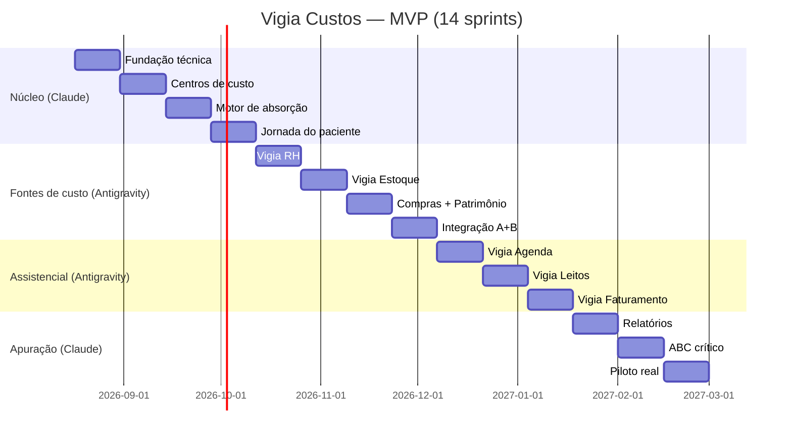

# Vigia Custos — MVP e Sprints

> [!abstract] Contexto
> Módulo novo dentro do ecossistema [[Vigia Saúde]] / [[Vigia Social]], focado em calcular o custo real do paciente na rede pública — da entrada na UBS até a alta — usando **custeio por absorção** como base e **ABC** nos centros críticos (UTI, centro cirúrgico). Escopo: rede municipal completa (atenção básica + hospitalar). Stack: Next.js App Router + TypeScript + Supabase (RLS) + Supabase Auth.

## Execução em dois caminhos (sem confronto)

> [!warning] Dois agentes, zero sobreposição
> Pra Claude e Antigravity trabalharem em paralelo sem conflito de arquivo/commit, o trabalho foi dividido em dois documentos separados, cada um dono de uma fatia do sistema que não se sobrepõe com a do outro:
> - **[[Vigia-Custos-Caminho-Claude]]** — Grupo A (Núcleo) + Grupo D (Apuração/ABC/Piloto)
> - **[[Vigia-Custos-Caminho-Antigravity]]** — Grupo B (satélites) + Grupo C (assistenciais)
>
> Acompanhamento contínuo em **[[Vigia-Custos-LOG-Execucao]]** — toda ação relevante de qualquer um dos dois caminhos é registrada lá.

## Nomenclatura dos sistemas

Cada módulo é um "satélite" plugável — conecta com sistema externo da secretaria OU roda nativo quando não existe nada.

| Nome do módulo | Função | Tipo | Responsável |
|---|---|---|---|
| **Vigia Custos** | Núcleo: centros de custo, motor de rateio (absorção), motor ABC, jornada do paciente, apuração | Núcleo — sempre nativo | Claude |
| **Vigia RH** | Cadastro de servidores, escalas, custo/hora, vínculo com centro de custo | Satélite plugável | Antigravity |
| **Vigia Estoque** | Farmácia, almoxarifado, insumos, OPME, lote/validade | Satélite plugável | Antigravity |
| **Vigia Compras** | Contratos, fornecedores, notas fiscais (limpeza, manutenção, utilities) | Satélite plugável | Antigravity |
| **Vigia Patrimônio** | Ativo fixo, depreciação de equipamento e prédio | Satélite plugável | Antigravity |
| **Vigia Agenda** | Agendamento/recepção — já existe parcialmente no [[Vigia Saúde]] (Módulo Clínico) | Reaproveitar existente | Antigravity |
| **Vigia Leitos** | Internação, transferência, isolamento | A construir (extensão do Módulo Clínico) | Antigravity |
| **Vigia Faturamento** | Convênios/SUS — não é custo, é receita, mas necessário pra comparar custo × repasse SIGTAP/TUSS | Satélite plugável | Antigravity |

> [!tip] Reaproveitamento
> O Módulo Clínico HTML (agendamento, gestão de pacientes, dashboards) já prototipado para o Vigia Saúde cobre boa parte do Vigia Agenda. Não recriar do zero — só adicionar o "gancho" que emite evento de custo para o Vigia Custos a cada ação (consulta, exame, internação).

---

## Repositórios de referência (GitHub)

Nenhum serve pra fork direto (stacks diferentes), mas todos economizam tempo de modelagem:

- **[frappe/erpnext](https://github.com/frappe/erpnext)** e **[frappe/hrms](https://github.com/frappe/hrms)** — melhor referência de modelo de dados para RH (folha, escalas, vínculos), Estoque (multi-warehouse, lote/validade) e **Ativo Fixo com depreciação** — esse último é o ponto que costuma faltar em sistema de custeio hospitalar público.
- **[Bahmni](https://github.com/Bahmni)** (OpenMRS + Odoo + OpenELIS) — referência de como separar módulo clínico de módulo administrativo/financeiro mantendo integração via eventos. Útil pra desenhar a fronteira entre Vigia Agenda/Leitos e Vigia Custos.
- **[RenatoKR/SIGTAP](https://github.com/RenatoKR/SIGTAP)** — mirror das tabelas SIGTAP atualizado diariamente via GitHub Actions. Usar direto como fonte pro comparativo custo × repasse SUS, sem precisar mexer no FTP do DATASUS.
- **[rfsaldanha/microdatasus](https://github.com/rfsaldanha/microdatasus)** — pacote R que já resolve o parsing de SIH, SIA e CNES do DATASUS. Mesmo sendo R, o layout de campos documentado ali é referência direta pro schema de internação (SIH) e produção ambulatorial (SIA).
- **[Razikus/supabase-nextjs-template](https://github.com/Razikus/supabase-nextjs-template)** — boilerplate Next.js 15 + Supabase com RLS, storage e template mobile (Expo) prontos. Bom ponto de partida pra não reescrever auth/RLS multi-tenant do zero.
- **[point-source/supabase-tenant-rbac](https://github.com/point-source/supabase-tenant-rbac)** — template específico de RBAC multi-tenant pra Supabase (papéis por tenant via RLS). Complementa o `Razikus/supabase-nextjs-template` no Sprint 1: um dá o esqueleto do app, esse dá o modelo de `perfis_acesso`/roles por secretaria.

> [!success] Verificação (12/08/2026)
> Todos os 6 repositórios acima foram checados: existem, estão ativos e a descrição bate com o uso proposto. Confirmado inclusive que o `RenatoKR/SIGTAP` roda sync diário via GitHub Actions (`.github/workflows/sync-datasus.yml`, 5h horário de Brasília) — pode ser usado direto como fonte, mas vale checar o badge de status antes do Sprint 11 pra garantir que o workflow segue ativo.
> Confirmado também que **não existe** hoje um repositório open-source pronto de custeio hospitalar (absorção/ABC) — reforça a decisão de construir o Grupo A nativo em vez de tentar adaptar um sistema pronto.

---

## Grupos e sprints

Sprints de 2 semanas, seguindo o padrão que você já usa (compras.vigiasaude.com teve 23 sprints em 5 fases). MVP total estimado: **14 sprints (~7 meses)**, focado em **um município piloto, um posto + uma internação simples**, só depois expandindo pra UTI/centro cirúrgico (ABC) e rede completa.

### Grupo A — Núcleo (Vigia Custos) · caminho [[Vigia-Custos-Caminho-Claude|Claude]]
> [!important] Por que primeiro
> Define o modelo de dados que todo o resto depende. Sem isso funcionando (mesmo com dados mockados), nenhum outro grupo tem pra onde emitir evento de custo.

- [ ] **Sprint 1 — Fundação técnica**
  - Setup Next.js App Router + TypeScript + Supabase (usar `Razikus/supabase-nextjs-template` como base de auth/RLS)
  - Multi-tenant: 1 tenant = 1 secretaria/município (referência de RBAC por tenant: `point-source/supabase-tenant-rbac`)
  - Modelagem inicial: `tenants`, `usuarios`, `perfis_acesso`
  - Critério de aceite: login multi-tenant funcionando com RLS isolando dados por secretaria

- [ ] **Sprint 2 — Centros de custo**
  - Tabelas: `centros_custo` (tipo: auxiliar/produtivo/crítico), `bases_rateio`, `matriz_rateio`
  - Cadastro configurável de driver de rateio (m², nº funcionários, kWh, kg roupa lavada)
  - Critério de aceite: cadastrar 3 centros auxiliares e 2 produtivos com uma base de rateio cada, via UI

- [ ] **Sprint 3 — Motor de absorção**
  - Função/job que executa o rateio: soma custo do período de cada auxiliar, distribui pros produtivos conforme driver
  - Testes com dados sintéticos (planilha de exemplo)
  - Critério de aceite: rodar rateio de um mês fictício e conferir manualmente que o resultado bate

- [ ] **Sprint 4 — Jornada do paciente**
  - Tabelas: `pacientes` (PID único), `episodios`, `eventos_custo` (tipo, centro de custo, timestamp, valor direto)
  - Função de acumulação: soma direto + fração rateada do centro por onde passou
  - Critério de aceite: criar manualmente um episódio com 3 eventos e ver o custo total calculado corretamente

---

### Grupo B — Fontes de custo (satélites) · caminho [[Vigia-Custos-Caminho-Antigravity|Antigravity]]
> [!note] Ordem de prioridade
> RH e Estoque primeiro — são os que mais pesam no custo direto e indireto. Compras/Patrimônio entram depois porque o volume de dado é menor e pode ser lançado manualmente no MVP.

- [ ] **Sprint 5 — Vigia RH (mínimo viável)**
  - Cadastro de servidor, vínculo, carga horária, custo/hora (referência de schema: `frappe/hrms`)
  - Vínculo servidor ↔ centro de custo
  - Conector de importação (CSV/planilha) pra quando a secretaria já tem RH próprio
  - Critério de aceite: importar uma planilha de servidores e ver o custo/hora aparecer nos centros de custo certos

- [ ] **Sprint 6 — Vigia Estoque (mínimo viável)**
  - Cadastro de item, lote, validade, saída vinculada a evento de custo
  - Conector de importação pra farmácia/almoxarifado externo
  - Critério de aceite: dar baixa de um medicamento num evento de paciente e ver o valor entrar no custo do episódio

- [ ] **Sprint 7 — Vigia Compras + Patrimônio (mínimo viável)**
  - Lançamento de nota fiscal de serviço/insumo indireto (limpeza, manutenção) vinculado a centro de custo auxiliar
  - Cadastro simplificado de ativo fixo com depreciação linear (referência: `frappe/erpnext` módulo Asset)
  - Critério de aceite: lançar uma nota de material de limpeza e ver ela entrar no rateio do Grupo A

- [ ] **Sprint 8 — Integração ponta a ponta Grupo A + B**
  - Rodar o ciclo completo: RH + Estoque + Compras alimentando os centros de custo, rateio rodando, jornada acumulando
  - Critério de aceite: simular um mês completo de um posto fictício e conferir o custo final de um paciente-teste à mão

---

### Grupo C — Módulos assistenciais · caminho [[Vigia-Custos-Caminho-Antigravity|Antigravity]]
> [!tip] Reaproveitamento
> Vigia Agenda já existe como protótipo (Módulo Clínico). O trabalho aqui é majoritariamente **integração** (emitir evento de custo), não construção do zero.

- [ ] **Sprint 9 — Vigia Agenda → gancho de custo**
  - Adaptar o Módulo Clínico existente para emitir `evento_custo` a cada consulta/procedimento simples
  - Critério de aceite: uma consulta feita na UBS aparece automaticamente na jornada do paciente com custo calculado

- [ ] **Sprint 10 — Vigia Leitos (internação simples)**
  - Modelo de internação: entrada, diária, transferência, alta — sem UTI/centro cirúrgico ainda
  - Cada diária gera evento de custo vinculado ao centro produtivo "enfermaria"
  - Critério de aceite: internar um paciente-teste por 3 dias e ver 3 eventos de diária com custo rateado corretamente

- [ ] **Sprint 11 — Vigia Faturamento (comparação com SUS)**
  - Importar tabela SIGTAP (usar `RenatoKR/SIGTAP` como fonte)
  - Comparar custo apurado × repasse SIGTAP/TUSS por procedimento
  - Critério de aceite: para o paciente-teste do Sprint 10, mostrar custo real vs. repasse SUS recebido

---

### Grupo D — Apuração, ABC crítico e piloto · caminho [[Vigia-Custos-Caminho-Claude|Claude]]
- [ ] **Sprint 12 — Relatórios e apuração final**
  - Dashboard: custo por paciente, por CID, por unidade, por período
  - Exportação (Excel/PDF)
  - Critério de aceite: gerar relatório de custo médio por internação do mês-teste

- [ ] **Sprint 13 — ABC nos centros críticos**
  - Modelagem de atividades (hora de ventilador, hora de sala cirúrgica, equipe por porte)
  - Direcionadores de atividade específicos, substituindo o rateio simples nesses centros
  - Critério de aceite: comparar custo de uma diária de UTI calculado por absorção simples vs. ABC — a diferença deve ser visível e defensável

- [ ] **Sprint 14 — Piloto real**
  - Rodar com dados reais de um posto + uma internação de um município parceiro (TCE-MS pode ser porta de entrada institucional)
  - Trilha de auditoria: log de quem definiu/alterou cada base de rateio
  - Critério de aceite: apuração de custo de um paciente real, auditável, comparável com o repasse recebido

---

## Timeline

## Próximos passos

- [ ] Validar esse escopo de MVP com um interlocutor institucional (TCE-MS ou secretaria piloto)
- [ ] Definir o município/unidade piloto antes do Sprint 14
- [ ] Desenhar schema Postgres/Supabase detalhado do Grupo A (próxima etapa técnica)

## Ver também

- [[Vigia Saúde]]
- [[Vigia Social]]
- [[TCE-MS]]
- [[Vigia-Custos-Caminho-Claude]]
- [[Vigia-Custos-Caminho-Antigravity]]
- [[Vigia-Custos-LOG-Execucao]]
