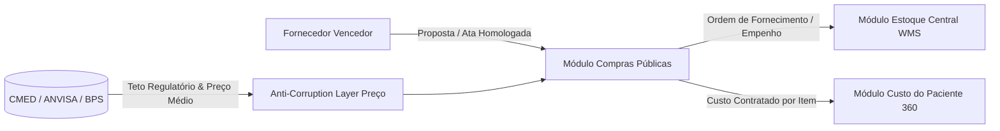

# Arquitetura Técnica de Módulo: Compras Públicas & Atas SRP (Módulo 01)

## 1. Visão Geral do Bounded Context
O módulo **Compras Públicas & Atas SRP** gerencia o ciclo de suprimentos e contratações do ecossistema hospitalar e da rede pública de saúde, em estrita conformidade com a **Lei Federal nº 14.133/2021 (Nova Lei de Licitações)** e resoluções da **CMED/ANVISA**. Ele é o portão de entrada de todos os insumos, medicamentos e serviços que serão consumidos pelo hospital.

### Diagrama de Fronteira de Contexto


---

## 2. Perfis e Governança RBAC Individualizada

| Perfil de Acesso | Tipo | Escopo e Responsabilidades |
| :--- | :---: | :--- |
| **`compras_operador`** | Operacional | • Cadastro de cotações, itens de edital e propostas vencedoras.<br>• Minuta de Atas de Registro de Preços (SRP).<br>• Geração de minutas de Pedido de Compra / Ordem de Fornecimento vinculadas a uma ata ativa. |
| **`compras_auditor_cmed`** | Técnico / Regulatório | • Validação do preço unitário contra o **PMVF (Preço Máximo de Venda ao Governo)** e média ponderada do **BPS**.<br>• Parecer formal do **Semáforo Anti-Prejuízo** (Verde = Liberado, Amarelo = Divergência Tolerada <5%, Vermelho = Bloqueio por Sobrepreço).<br>• Emissão de relatórios preventivos para TCE/TCU. |
| **`compras_admin`** | Administrador do Módulo | • **Homologação formal de Atas de Registro de Preços**.<br>• Autorização de pedidos de **Adesão de Carona** (aplicando trava legal de 50% por item para caronas e 200% global).<br>• Emissão e assinatura do **Empenho Digital**, autorizando faturamento e liquidação. |

---

## 3. Modelo de Dados (Supabase `oogpcdaosexarxmvupiw`)

```sql
-- Schema de isolamento: satelites
CREATE SCHEMA IF NOT EXISTS satelites;

-- Tabela de Atas de Registro de Preços
CREATE TABLE IF NOT EXISTS satelites.atas_registro_precos (
    id UUID PRIMARY KEY DEFAULT gen_random_uuid(),
    tenant_id UUID NOT NULL,
    numero_ata VARCHAR(50) NOT NULL UNIQUE,
    processo_licitatorio VARCHAR(100) NOT NULL,
    modalidade VARCHAR(50) DEFAULT 'Pregão Eletrônico SRP',
    fornecedor_razao_social VARCHAR(255) NOT NULL,
    fornecedor_cnpj VARCHAR(18) NOT NULL,
    data_assinatura DATE NOT NULL,
    data_vigencia_inicio DATE NOT NULL,
    data_vigencia_fim DATE NOT NULL,
    valor_total_registrado NUMERIC(15,2) NOT NULL,
    valor_saldo_disponivel NUMERIC(15,2) NOT NULL,
    status VARCHAR(30) DEFAULT 'ativa' CHECK (status IN ('rascunho', 'ativa', 'suspensa', 'esgotada', 'cancelada')),
    limite_carona_global_percentual NUMERIC(5,2) DEFAULT 200.00,
    criado_em TIMESTAMPTZ DEFAULT NOW(),
    atualizado_em TIMESTAMPTZ DEFAULT NOW(),
    homologado_por VARCHAR(150),
    homologado_em TIMESTAMPTZ
);

-- Tabela de Itens da Ata
CREATE TABLE IF NOT EXISTS satelites.itens_ata_registro_precos (
    id UUID PRIMARY KEY DEFAULT gen_random_uuid(),
    ata_id UUID NOT NULL REFERENCES satelites.atas_registro_precos(id) ON DELETE CASCADE,
    codigo_catmat VARCHAR(20),
    principio_ativo VARCHAR(255) NOT NULL,
    apresentacao VARCHAR(255) NOT NULL,
    quantidade_registrada INT NOT NULL,
    quantidade_saldo_orgao INT NOT NULL,
    quantidade_saldo_carona INT NOT NULL,
    valor_unitario_registrado NUMERIC(15,4) NOT NULL,
    preco_teto_cmed NUMERIC(15,4),
    preco_medio_bps NUMERIC(15,4),
    status_semaforo_preco VARCHAR(20) DEFAULT 'verde' CHECK (status_semaforo_preco IN ('verde', 'amarelo', 'vermelho', 'branco')),
    justificativa_auditoria TEXT
);

-- Tabela de Pedidos de Compra / Ordens de Fornecimento
CREATE TABLE IF NOT EXISTS satelites.pedidos_compra (
    id UUID PRIMARY KEY DEFAULT gen_random_uuid(),
    tenant_id UUID NOT NULL,
    numero_pedido VARCHAR(50) NOT NULL UNIQUE,
    ata_id UUID REFERENCES satelites.atas_registro_precos(id),
    tipo_solicitacao VARCHAR(30) DEFAULT 'orgao_gerenciador' CHECK (tipo_solicitacao IN ('orgao_gerenciador', 'orgao_participante', 'carona')),
    orgao_demandante VARCHAR(200) NOT NULL,
    numero_empenho VARCHAR(50),
    valor_total NUMERIC(15,2) NOT NULL,
    status VARCHAR(30) DEFAULT 'solicitado' CHECK (status IN ('solicitado', 'empenhado', 'em_transito', 'entregue', 'liquidado', 'cancelado')),
    criado_por VARCHAR(150) NOT NULL,
    aprovado_por VARCHAR(150),
    criado_em TIMESTAMPTZ DEFAULT NOW()
);
```

---

## 4. Regras de Negócio Críticas
1. **RN-COMP-01 (Trava Anti-Sobrepreço)**: Se `valor_unitario_registrado > preco_teto_cmed`, o sistema força status `vermelho` e impede a emissão de empenho, a menos que haja autorização judicial registrada.
2. **RN-COMP-02 (Trava de Adesão de Carona - Lei 14.133/21)**: O quantitativo decorrente de adesões à ata não pode exceder, por órgão não participante, a 50% dos quantitativos registrados.
3. **RN-COMP-03 (Abatimento Automático de Saldo)**: Cada pedido com status `empenhado` desconta atomicamente da cota do item na ata.

---

## 5. Contratos de Integração & Eventos
- **Evento Emitido**: `compras.pedido_empenhado` ➔ Escutado pelo **Módulo 2 (Estoque Central WMS)** para pré-notificação de recebimento físico (ASN).
- **Consumo de Dados**: Fornece custo unitário contratado para o **Módulo 12 (Custo do Paciente 360)**.
