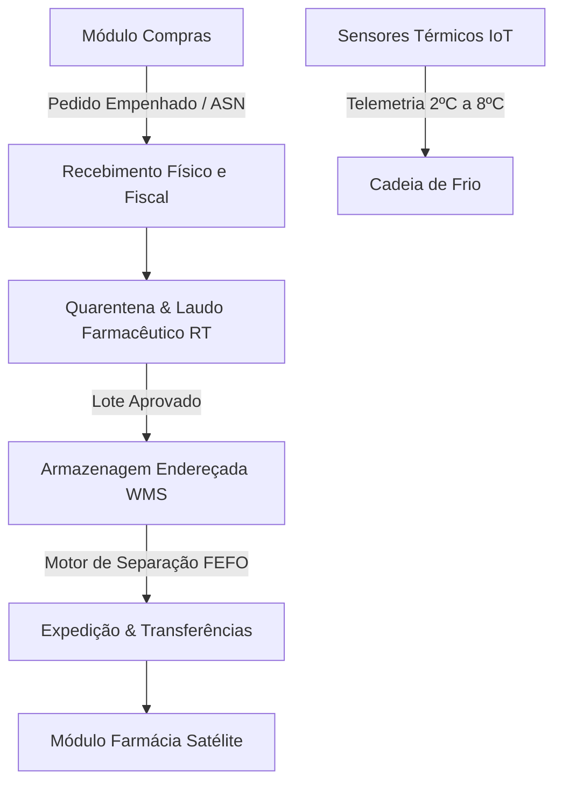

# Arquitetura Técnica de Módulo: Estoque Central WMS & Cadeia de Frio (Módulo 02)

## 1. Visão Geral do Bounded Context
O módulo **Estoque Central WMS & Cadeia de Frio** é o centro logístico e regulatório do ecossistema hospitalar. Baseado nas diretrizes da **RDC ANVISA nº 430/2020** e padrões dos sistemas **OpenBoxes** e **OpenWMS**, ele é responsável pelo recebimento físico e fiscal, quarentena técnica, guarda endereçada (WMS), telemetria contínua da cadeia de frio (2ºC a 8ºC e 15ºC a 25ºC) e expedição por data de validade estrita (**FEFO - First-Expired, First-Out**).

### Diagrama de Fronteira de Contexto


---

## 2. Perfis e Governança RBAC Individualizada

| Perfil de Acesso | Tipo | Escopo e Responsabilidades |
| :--- | :---: | :--- |
| **`estoque_conferente`** | Operacional | • Importação e parse de XML Danfe/NF-e.<br>• Bipagem ótica de caixas recebidas e conferência de avarias.<br>• Alocação e movimentação física entre posições WMS (Rua, Prateleira, Bloco, Nível).<br>• Separação de lotes para transferência guiada por FEFO. |
| **`estoque_farmaceutico_rt`** | Técnico / Sanitário | • Responsável Técnico (CRF) pelo recebimento de termolábeis e controlados.<br>• Liberação ou retenção de lotes na **Quarentena** mediante laudo analítico do fabricante.<br>• Auditoria de relatórios de telemetria da **Cadeia de Frio** e registro de excursões de temperatura.<br>• Emissão e execução de **Recall Sanitário** com bloqueio preventivo universal. |
| **`estoque_admin_cd`** | Administrador do Módulo | • Parametrização da malha física do CD (zonas secas, climatizadas, câmaras frias).<br>• Homologação de inventários rotativos e cíclicos com ajustes contábeis.<br>• Autorização final de descarte/baixa e emissão de Termo de Inutilização Farmacêutica. |

---

## 3. Modelo de Dados (Supabase `oogpcdaosexarxmvupiw`)

```sql
-- Locais e Zonas de Armazenamento WMS
CREATE TABLE IF NOT EXISTS satelites.locais_armazenamento (
    id UUID PRIMARY KEY DEFAULT gen_random_uuid(),
    tenant_id UUID NOT NULL,
    codigo_local VARCHAR(50) NOT NULL UNIQUE,
    nome_local VARCHAR(150) NOT NULL,
    tipo_zona VARCHAR(50) DEFAULT 'climatizada' CHECK (tipo_zona IN ('camara_fria_2_8', 'climatizada_15_25', 'temperatura_ambiente', 'quarentena', 'controlados_segregados')),
    temperatura_minima NUMERIC(4,1) DEFAULT 15.0,
    temperatura_maxima NUMERIC(4,1) DEFAULT 25.0,
    capacidade_paletes INT DEFAULT 100,
    ativo BOOLEAN DEFAULT TRUE
);

-- Posições Físicas e Lotes no Estoque (WMS + FEFO)
CREATE TABLE IF NOT EXISTS satelites.posicoes_estoque_lotes (
    id UUID PRIMARY KEY DEFAULT gen_random_uuid(),
    local_id UUID NOT NULL REFERENCES satelites.locais_armazenamento(id),
    endereco_wms VARCHAR(50) NOT NULL, -- Ex: R01-P03-B02-N01
    codigo_material VARCHAR(50) NOT NULL,
    descricao_material VARCHAR(255) NOT NULL,
    numero_lote VARCHAR(50) NOT NULL,
    data_fabricacao DATE NOT NULL,
    data_validade DATE NOT NULL,
    quantidade_disponivel INT NOT NULL DEFAULT 0,
    quantidade_bloqueada INT NOT NULL DEFAULT 0,
    status_lote VARCHAR(30) DEFAULT 'liberado' CHECK (status_lote IN ('quarentena', 'liberado', 'recolhido_recall', 'vencido', 'descarte')),
    valor_unitario_aquisicao NUMERIC(15,4) NOT NULL,
    criado_em TIMESTAMPTZ DEFAULT NOW(),
    atualizado_em TIMESTAMPTZ DEFAULT NOW()
);

-- Telemetria da Cadeia de Frio (IoT / RDC 430)
CREATE TABLE IF NOT EXISTS satelites.leituras_temperatura_cd (
    id UUID PRIMARY KEY DEFAULT gen_random_uuid(),
    local_id UUID NOT NULL REFERENCES satelites.locais_armazenamento(id),
    sensor_id VARCHAR(50) NOT NULL,
    temperatura_registrada NUMERIC(4,2) NOT NULL,
    umidade_registrada NUMERIC(4,1),
    em_conformidade BOOLEAN NOT NULL DEFAULT TRUE,
    data_hora_leitura TIMESTAMPTZ DEFAULT NOW()
);

-- Transferências Internas (CD ➔ Farmácias Satélites)
CREATE TABLE IF NOT EXISTS satelites.transferencias_internas (
    id UUID PRIMARY KEY DEFAULT gen_random_uuid(),
    numero_transferencia VARCHAR(50) NOT NULL UNIQUE,
    origem_local_id UUID NOT NULL REFERENCES satelites.locais_armazenamento(id),
    destino_unidade VARCHAR(150) NOT NULL, -- Farmácia Central, Farmácia UTI, etc.
    status VARCHAR(30) DEFAULT 'aguardando_separacao' CHECK (status IN ('aguardando_separacao', 'em_separacao_fefo', 'em_transito', 'recebida', 'cancelada')),
    responsavel_envio VARCHAR(150),
    data_envio TIMESTAMPTZ,
    data_recebimento TIMESTAMPTZ
);
```

---

## 4. Regras de Negócio Críticas
1. **RN-EST-01 (Algoritmo Estrito FEFO)**: Ao solicitar separação de um item, o sistema reserva automaticamente o lote com menor data de validade que possua status `liberado`.
2. **RN-EST-02 (Trava de Quarentena Sanitária)**: Todo lote recém-importado entra com status `quarentena` e não pode ser movimentado para separação até receber o despacho digital do Farmacêutico RT.
3. **RN-EST-03 (Alerta e Bloqueio Térmico - RDC 430)**: Caso um sensor de câmara fria registre temperatura fora de 2ºC a 8ºC por mais de 30 minutos contínuos, os lotes daquela câmara são preventivamente colocados em quarentena para análise de estabilidade.

---

## 5. Contratos de Integração & Eventos
- **Evento Emitido**: `estoque.transferencia_enviada` ➔ Notifica a Farmácia Satélite para recebimento físico.
- **Evento Consumido**: `farmacia.solicitacao_reposicao` ➔ Gera pedido de separação no CD.
