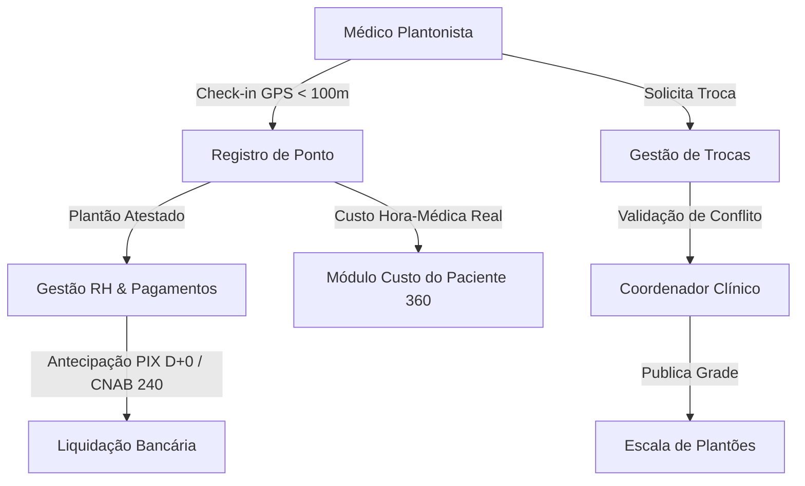

# Arquitetura Técnica de Módulo: Escala Médica & Plantões Hospitalares (Módulo 03)

## 1. Visão Geral do Bounded Context
O módulo **Escala Médica & Plantões Hospitalares** gerencia o corpo clínico do hospital, contemplando o planejamento de escalas mensais, controle biométrico/georreferenciado de presença em plantão, trocas sem buracos na cobertura assistencial, cofre de conformidade ética e profissional (CFM/RQE/certificações) e liquidação financeira de plantões (antecipação PIX D+0 e geração de arquivos bancários CNAB 240). Inspirado na arquitetura do sistema **OpenHRApp** e nas resoluções éticas do **CFM**.

### Diagrama de Fronteira de Contexto


---

## 2. Perfis e Governança RBAC Individualizada

| Perfil de Acesso | Tipo | Escopo e Responsabilidades |
| :--- | :---: | :--- |
| **`escala_medico_plantonista`** | Assistencial | • Visualização da sua grade de plantões e escalas abertas para cobertura voluntária.<br>• Registro de ponto digital com **Geofencing GPS < 100m** e validação de selfie/biometria.<br>• Solicitação formal de troca de plantão com indicação de colega substituto.<br>• Solicitação de **Antecipação PIX D+0** do plantão realizado e atestado. |
| **`escala_coordenador_clinico`** | Gestão Clínica | • Criação e publicação de escalas médicas por setor (UTI, Pronto-Socorro, Centro Cirúrgico, Enfermaria).<br>• Análise e aprovação de solicitações de trocas de plantão.<br>• Atesto de presença e lançamento de ocorrências de atraso ou abandono de plantão. |
| **`escala_gestor_rh_admin`** | Administrador do Módulo | • Gestão do **Cofre de Conformidade Médica** (validação de CRM no CFM, RQE de especialista, ATLS, ACLS, PALS e certidões éticas).<br>• Configuração de valores da hora-médica por especialidade, dia da semana e feriados.<br>• **Aprovação de lotes de pagamento PIX e exportação de remessa bancária CNAB 240**. |

---

## 3. Modelo de Dados (Supabase `oogpcdaosexarxmvupiw`)

```sql
-- Cadastro de Escalas Médicas Hospitalares
CREATE TABLE IF NOT EXISTS satelites.escalas_medicas (
    id UUID PRIMARY KEY DEFAULT gen_random_uuid(),
    tenant_id UUID NOT NULL,
    setor_hospitalar VARCHAR(100) NOT NULL, -- UTI Geral, Pronto-Socorro Adulto, Pediatria, Centro Cirúrgico
    especialidade VARCHAR(100) NOT NULL, -- Intensivista, Cirurgião Geral, Anestesista, Clínico
    data_plantao DATE NOT NULL,
    turno VARCHAR(30) NOT NULL CHECK (turno IN ('diurno_12h', 'noturno_12h', 'integral_24h', 'sobreaviso')),
    horario_inicio TIME NOT NULL,
    horario_fim TIME NOT NULL,
    medico_escalado_nome VARCHAR(150) NOT NULL,
    medico_crm VARCHAR(20) NOT NULL,
    medico_uf_crm VARCHAR(2) NOT NULL,
    medico_cpf VARCHAR(14) NOT NULL,
    valor_plantao_bruto NUMERIC(10,2) NOT NULL,
    status_escala VARCHAR(30) DEFAULT 'confirmada' CHECK (status_escala IN ('aberta', 'confirmada', 'troca_solicitada', 'em_andamento', 'concluida', 'ausente')),
    publicada_por VARCHAR(150),
    criado_em TIMESTAMPTZ DEFAULT NOW()
);

-- Registro de Ponto Eletrônico Georreferenciado
CREATE TABLE IF NOT EXISTS satelites.registros_ponto_plantao (
    id UUID PRIMARY KEY DEFAULT gen_random_uuid(),
    escala_id UUID NOT NULL REFERENCES satelites.escalas_medicas(id) ON DELETE CASCADE,
    medico_crm VARCHAR(20) NOT NULL,
    checkin_horario TIMESTAMPTZ NOT NULL,
    checkin_latitude NUMERIC(10,7) NOT NULL,
    checkin_longitude NUMERIC(10,7) NOT NULL,
    checkin_distancia_metros NUMERIC(6,1) NOT NULL, -- Deve ser < 100m
    checkout_horario TIMESTAMPTZ,
    checkout_latitude NUMERIC(10,7),
    checkout_longitude NUMERIC(10,7),
    horas_cumpridas NUMERIC(4,2),
    status_atesto VARCHAR(30) DEFAULT 'pendente' CHECK (status_atesto IN ('pendente', 'atestado_coordenador', 'divergencia', 'rejeitado')),
    atestado_por VARCHAR(150),
    atestado_em TIMESTAMPTZ
);

-- Antecipações de Pagamento PIX / CNAB 240
CREATE TABLE IF NOT EXISTS satelites.antecipacoes_pix_plantao (
    id UUID PRIMARY KEY DEFAULT gen_random_uuid(),
    escala_id UUID NOT NULL REFERENCES satelites.escalas_medicas(id),
    medico_chave_pix VARCHAR(150) NOT NULL,
    valor_solicitado NUMERIC(10,2) NOT NULL,
    taxa_antecipacao NUMERIC(10,2) DEFAULT 0.00,
    valor_liquido NUMERIC(10,2) NOT NULL,
    status_pagamento VARCHAR(30) DEFAULT 'solicitado' CHECK (status_pagamento IN ('solicitado', 'aprovado_rh', 'pago_pix_d0', 'cancelado')),
    id_transacao_pix VARCHAR(100),
    lote_cnab_id VARCHAR(50),
    pago_em TIMESTAMPTZ
);
```

---

## 4. Regras de Negócio Críticas
1. **RN-ESC-01 (Cerca Eletrônica de Ponto < 100m)**: O check-in só é validado se a coordenada GPS estiver dentro do raio de 100 metros do perímetro hospitalar configurado para a unidade.
2. **RN-ESC-02 (Anti-Conflito de Trocas)**: Uma troca de plantão é automaticamente bloqueada caso o médico receptor já possua outro plantão na mesma data/turno em qualquer setor do hospital.
3. **RN-ESC-03 (Elegibilidade para Antecipação PIX)**: O médico só pode solicitar antecipação de plantão após o status do ponto estar com `atestado_coordenador`.

---

## 5. Contratos de Integração & Eventos
- **Evento Emitido**: `escala.plantao_concluido` ➔ Envia o custo de hora-médica real para apropriação no **Módulo 12 (Custo do Paciente 360)**.
- **Evento Consumido**: `clinica.demanda_extraordinaria` ➔ Alerta necessidade de abertura de vagas na escala de sobreaviso.
