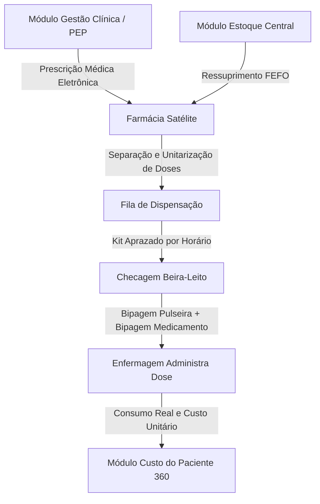

# Arquitetura Técnica de Módulo: Farmácia Satélite & Dispensação Beira-Leito (Módulo 04)

## 1. Visão Geral do Bounded Context
O módulo **Farmácia Satélite & Dispensação Beira-Leito** fecha o elo entre a logística farmacêutica e a assistência direta ao paciente. Baseado nos protocolos internacionais de **Segurança do Paciente (Erro Zero)** e na arquitetura documentada em `ARQUITETURA medicamento.md`, este módulo gerencia estoques satélites descentralizados (enfermarias, UTI, bloco cirúrgico), o aprazamento de prescrições médicas e a checagem beira-leito com validação de código de barras (**Pulseira do Paciente + Embalagem Unitária do Medicamento**).

### Diagrama de Fronteira de Contexto


---

## 2. Perfis e Governança RBAC Individualizada

| Perfil de Acesso | Tipo | Escopo e Responsabilidades |
| :--- | :---: | :--- |
| **`farmacia_dispensador`** | Operacional | • Recepção da prescrição eletrônica médica aprazada por horário.<br>• Unitarização de medicamentos com etiquetagem de código de barras.<br>• Separação física dos sachês/gavetas por leito e paciente.<br>• Baixa automática no estoque da farmácia satélite respeitando o lote FEFO. |
| **`farmacia_enfermeiro_checador`** | Assistencial | • Leitura ótica à beira do leito da pulseira de identificação do paciente.<br>• Bipagem da dose do medicamento.<br>• Validação dos **5 Certos** (Paciente Certo, Medicamento Certo, Dose Certa, Via Certa, Horário Certo).<br>• Registro de administração confirmada ou recusa/devolução com motivo assistencial. |
| **`farmacia_supervisor_admin`** | Administrador do Módulo | • Gestão dos pontos de estoque descentralizados (farmácias satélites das alas).<br>• Controle estrito de medicamentos sob controle especial (Portaria 344/98 e livro SNGPC).<br>• Parametrização de regras de substituição terapêutica e duplo-cheque para medicamentos de alta vigilância (MAV).<br>• Gestão de devoluções ao estoque central e notificações de farmacovigilância. |

---

## 3. Modelo de Dados (Supabase `oogpcdaosexarxmvupiw`)

```sql
-- Unidades de Farmácia Satélite
CREATE TABLE IF NOT EXISTS satelites.farmacias_satelites (
    id UUID PRIMARY KEY DEFAULT gen_random_uuid(),
    tenant_id UUID NOT NULL,
    nome_satelite VARCHAR(100) NOT NULL, -- Ex: Satélite UTI Geral, Satélite Bloco Cirúrgico
    setor_atendido VARCHAR(100) NOT NULL,
    farmaceutico_responsavel VARCHAR(150),
    ativo BOOLEAN DEFAULT TRUE
);

-- Fila de Dispensações por Paciente e Prescrição
CREATE TABLE IF NOT EXISTS satelites.dispensacoes_paciente (
    id UUID PRIMARY KEY DEFAULT gen_random_uuid(),
    tenant_id UUID NOT NULL,
    paciente_id UUID NOT NULL,
    episodio_id UUID NOT NULL,
    prescricao_id UUID NOT NULL,
    farmacia_satelite_id UUID NOT NULL REFERENCES satelites.farmacias_satelites(id),
    data_hora_aprazamento TIMESTAMPTZ NOT NULL,
    status VARCHAR(30) DEFAULT 'aguardando_separacao' CHECK (status IN ('aguardando_separacao', 'separado_kit', 'entregue_posto', 'administrado_beira_leito', 'devolvido_parcial', 'cancelado')),
    separado_por VARCHAR(150),
    separado_em TIMESTAMPTZ,
    administrado_por VARCHAR(150),
    administrado_em TIMESTAMPTZ
);

-- Itens da Fila de Dispensação (Doses Unitarizadas)
CREATE TABLE IF NOT EXISTS satelites.itens_dispensados (
    id UUID PRIMARY KEY DEFAULT gen_random_uuid(),
    dispensacao_id UUID NOT NULL REFERENCES satelites.dispensacoes_paciente(id) ON DELETE CASCADE,
    codigo_material VARCHAR(50) NOT NULL,
    descricao_medicamento VARCHAR(255) NOT NULL,
    dose_prescrita VARCHAR(50) NOT NULL,
    via_administracao VARCHAR(50) NOT NULL, -- Oral, Intravenosa, Subcutânea, Inalatória
    numero_lote VARCHAR(50) NOT NULL,
    data_validade DATE NOT NULL,
    quantidade_prescrita NUMERIC(6,2) NOT NULL,
    quantidade_administrada NUMERIC(6,2) DEFAULT 0,
    custo_unitario_dose NUMERIC(10,4) NOT NULL,
    status_item VARCHAR(30) DEFAULT 'separado' CHECK (status_item IN ('separado', 'administrado', 'recusado_paciente', 'suspenso_medico', 'devolvido')),
    justificativa_devolucao TEXT
);

-- Notificações de Farmacovigilância / Quase-Erro (Near Miss)
CREATE TABLE IF NOT EXISTS satelites.notificacoes_farmacovigilancia (
    id UUID PRIMARY KEY DEFAULT gen_random_uuid(),
    paciente_id UUID NOT NULL,
    tipo_evento VARCHAR(50) NOT NULL CHECK (tipo_evento IN ('quase_erro_barrado', 'reacao_adversa_grave', 'falha_rotulagem', 'medicamento_inaudito')),
    descricao_evento TEXT NOT NULL,
    notificado_por VARCHAR(150) NOT NULL,
    criado_em TIMESTAMPTZ DEFAULT NOW()
);
```

---

## 4. Regras de Negócio Críticas
1. **RN-FAR-01 (Trava do Duplo-Cheque para MAVs)**: Medicamentos de Alta Vigilância (ex: Insulina regular, Cloreto de Potássio injetável, Quimioterápicos) exigem confirmação biométrica ou senha de duas pessoas de enfermagem no momento da checagem beira-leito.
2. **RN-FAR-02 (Estorno Imediato de Estoque em Devolução)**: Doses intactas devolvidas ao satélite retornam imediatamente ao saldo disponível daquela farmácia com registro contábil de crédito no custo do paciente.
3. **RN-FAR-03 (Interrupção de Beira-Leito por Incompatibilidade)**: Se o código de barras da dose bipada não coincidir exatamente com o princípio ativo prescrito, o sistema sobe alerta visual sonoro e bloqueia a confirmação.

---

## 5. Contratos de Integração & Eventos
- **Evento Emitido**: `farmacia.dose_administrada` ➔ Transmite custo real do medicamento administrado para apropriação direta no prontuário do paciente e cálculo de absorção no **Módulo 12 (Custo do Paciente 360)**.
- **Evento Consumido**: `clinica.prescricao_suspensa` ➔ Cancela imediatamente itens pendentes na fila de dispensação.
