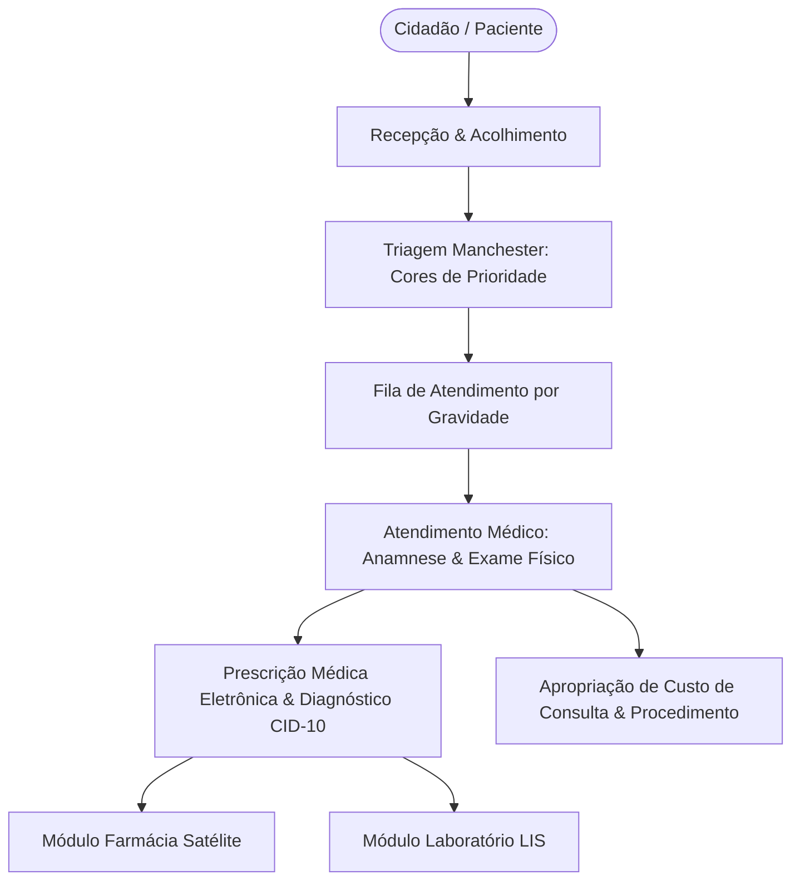

# Arquitetura Técnica de Módulo: Gestão Clínica & PEP - Prontuário Eletrônico (Módulo 05)

## 1. Visão Geral do Bounded Context
O módulo **Gestão Clínica & PEP (Prontuário Eletrônico do Paciente)** é o núcleo assistencial do hospital, fundamentado nos conceitos arquiteturais do **OpenEMR** e em conformidade estrita com a **Resolução CFM nº 1.821/07** e a **LGPD**. Ele cobre desde o acolhimento na recepção, passando pela classificação de risco pelo **Protocolo de Manchester**, até a anamnese médica, prescrição estruturada com alertas de alergias/interações e apuração do DRE de consultório.

### Diagrama de Fronteira de Contexto


---

## 2. Perfis e Governança RBAC Individualizada

| Perfil de Acesso | Tipo | Escopo e Responsabilidades |
| :--- | :---: | :--- |
| **`clinica_recepcionista`** | Operacional | • Cadastro de dados civis do paciente (Nome, CPF, CNS, Contato, Endereço).<br>• Emissão de senha eletrônica de chegada e abertura do episódio de atendimento.<br>• Conferência de cobertura de convênio ou elegibilidade SUS. |
| **`clinica_enfermeiro_triagem`** | Assistencial | • Aferição completa de sinais vitais (PA, FC, FR, SpO2, Temperatura, Glicemia capilar).<br>• Aplicação do **Protocolo de Manchester** com definição da cor de prioridade clínica.<br>• Encaminhamento automático do paciente para a fila correta de espera médica com tempo alvo de atendimento. |
| **`clinica_medico_assistente`** | Clínico | • Registro da anamnese, história pregressa, antecedentes familiares e exame físico.<br>• Definição de hipóteses diagnósticas padronizadas em **CID-10 / CID-11**.<br>• Prescrição médica estruturada com checagem automática de alergias cruzadas.<br>• Emissão de atestados médicos, laudos e encaminhamentos com assinatura digital (ICP-Brasil). |
| **`clinica_diretor_medico_admin`** | Administrador do Módulo | • Gestão das escalas de atendimento por consultório e especialidade.<br>• Auditoria de tempos médios de espera (SLA por cor de triagem) e tempo de consulta médica.<br>• Acompanhamento do **DRE do Consultório**: custo de insumos clínicos, tempo médico e receita por procedimento. |

---

## 3. Modelo de Dados (Supabase `oogpcdaosexarxmvupiw`)

```sql
-- Episódios e Atendimentos Clínicos
CREATE TABLE IF NOT EXISTS satelites.atendimentos_clinicos (
    id UUID PRIMARY KEY DEFAULT gen_random_uuid(),
    tenant_id UUID NOT NULL,
    numero_atendimento VARCHAR(50) NOT NULL UNIQUE,
    paciente_id UUID NOT NULL,
    data_hora_chegada TIMESTAMPTZ DEFAULT NOW(),
    tipo_atendimento VARCHAR(50) DEFAULT 'urgencia' CHECK (tipo_atendimento IN ('urgencia', 'ambulatorio', 'internacao', 'retorno')),
    convenio_plano VARCHAR(100) DEFAULT 'SUS',
    status VARCHAR(30) DEFAULT 'aguardando_triagem' CHECK (status IN ('aguardando_triagem', 'triagem_concluida', 'em_consulta_medica', 'em_observacao', 'alta_medica', 'transferido', 'obito')),
    criado_em TIMESTAMPTZ DEFAULT NOW()
);

-- Triagem e Classificação de Risco (Protocolo de Manchester)
CREATE TABLE IF NOT EXISTS satelites.triagens_manchester (
    id UUID PRIMARY KEY DEFAULT gen_random_uuid(),
    atendimento_id UUID NOT NULL REFERENCES satelites.atendimentos_clinicos(id) ON DELETE CASCADE,
    queixa_principal TEXT NOT NULL,
    pressao_arterial_sistolica INT,
    pressao_arterial_diastolica INT,
    frequencia_cardiaca INT,
    frequencia_respiratoria INT,
    saturacao_o2 INT,
    temperatura NUMERIC(3,1),
    escala_dor INT CHECK (escala_dor BETWEEN 0 AND 10),
    cor_prioridade VARCHAR(20) NOT NULL CHECK (cor_prioridade IN ('vermelho', 'laranja', 'amarelo', 'verde', 'azul')),
    tempo_alvo_minutos INT NOT NULL, -- Vermelho: 0m, Laranja: 10m, Amarelo: 60m, Verde: 120m, Azul: 240m
    enfermeiro_triagem VARCHAR(150) NOT NULL,
    triado_em TIMESTAMPTZ DEFAULT NOW()
);

-- Prontuário Clínico & Evolução Médica (PEP)
CREATE TABLE IF NOT EXISTS satelites.evolucoes_medicas (
    id UUID PRIMARY KEY DEFAULT gen_random_uuid(),
    atendimento_id UUID NOT NULL REFERENCES satelites.atendimentos_clinicos(id) ON DELETE CASCADE,
    medico_crm VARCHAR(20) NOT NULL,
    medico_nome VARCHAR(150) NOT NULL,
    anamnese TEXT NOT NULL,
    exame_fisico TEXT NOT NULL,
    cid10_codigo VARCHAR(10) NOT NULL,
    cid10_descricao VARCHAR(255) NOT NULL,
    conduta_plano_terapeutico TEXT NOT NULL,
    assinatura_digital_hash VARCHAR(255),
    data_hora_atendimento TIMESTAMPTZ DEFAULT NOW()
);

-- Prescrições Médicas Estruturadas
CREATE TABLE IF NOT EXISTS satelites.prescricoes_medicas (
    id UUID PRIMARY KEY DEFAULT gen_random_uuid(),
    atendimento_id UUID NOT NULL REFERENCES satelites.atendimentos_clinicos(id) ON DELETE CASCADE,
    medico_crm VARCHAR(20) NOT NULL,
    status_prescricao VARCHAR(30) DEFAULT 'ativa' CHECK (status_prescricao IN ('ativa', 'suspensa', 'concluida')),
    valida_ate TIMESTAMPTZ NOT NULL,
    criado_em TIMESTAMPTZ DEFAULT NOW()
);
```

---

## 4. Regras de Negócio Críticas
1. **RN-CLI-01 (Priorização Imediata - Manchester Vermelho)**: Caso a triagem classifique o paciente como Vermelho (Emergência), o sistema dispara alerta visual em todos os terminais médicos e insere o paciente no topo absoluto da fila sem possibilidade de adiamento.
2. **RN-CLI-02 (Checagem de Alergia Cruzada)**: No ato da prescrição médica, se o princípio ativo selecionado constar na lista de alergias registradas no prontuário do paciente, o sistema bloqueia a gravação e exige substituição ou justificativa expressa de risco assumido.
3. **RN-CLI-03 (Imutabilidade de Evolução Médica - CFM 1.821/07)**: Após a assinatura eletrônica do médico, o texto da evolução torna-se imutável no banco de dados. Eventuais correções só podem ser feitas mediante nova entrada de adendo datado e assinado.

---

## 5. Contratos de Integração & Eventos
- **Evento Emitido**: `clinica.prescricao_gerada` ➔ Envia automaticamente os itens de medicação para separação na Farmácia Satélite (Módulo 04) e pedidos de exames para o Laboratório LIS (Módulo 06).
- **Consumo de Dados**: Fornece os registros de procedimentos e consultas clínicas para consolidação de custo e margem no **Módulo 12 (Custo do Paciente 360)**.
