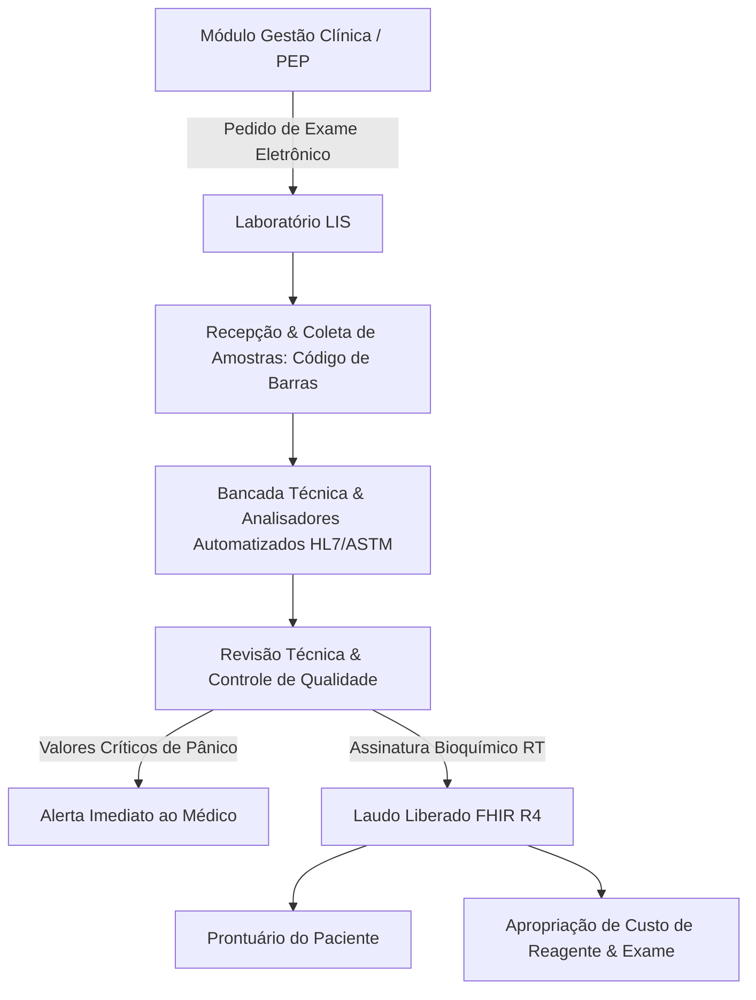

# Arquitetura Técnica de Módulo: Laboratório Clínico & LIS (Módulo 06)

## 1. Visão Geral do Bounded Context
O módulo **Laboratório Clínico & LIS (Laboratory Information System)** gerencia toda a esteira de análises clínicas do hospital, desde a solicitação médica de exames, coleta de tubos biológicos e rotulagem com código de barras, até a integração com analisadores automatizados, controle de qualidade analítica (Levey-Jennings), liberação de valores de pânico e emissão de laudos técnicos em conformidade com a **RDC ANVISA nº 786/2023** e padrão internacional **HL7 FHIR R4 (DiagnosticReport / Observation)**. Inspirado no sistema open-source **Senaite LIS**.

### Diagrama de Fronteira de Contexto


---

## 2. Perfis e Governança RBAC Individualizada

| Perfil de Acesso | Tipo | Escopo e Responsabilidades |
| :--- | :---: | :--- |
| **`lab_coletor_amostras`** | Operacional | • Recepção e conferência da identidade do paciente.<br>• Impressão de etiquetas de código de barras para os tubos específicos (EDTA, Gel Separador, Citrato, etc.).<br>• Registro do horário de punção/coleta e encaminhamento das amostras para a triagem biológica. |
| **`lab_tecnico_analista`** | Técnico | • Montagem de lotes de bancada e inserção de amostras em analisadores automatizados.<br>• Conferência de interfaces técnicas (HL7 / ASTM) e digitação de resultados manuais (uroanálise, parasitologia, etc.).<br>• Sinalização de interferentes pré-analíticos (amostras hemolisadas, lipêmicas, ictéricas ou com volume insuficiente). |
| **`lab_bioquimico_liberador`** | Técnico / Científico | • Avaliação da consistência fisiopatológica dos resultados e checagem de delta-check com exames anteriores.<br>• Acionamento imediato de protocolo para **Valores de Pânico** (ex: Troponina elevada, Potássio crítico, Plaquetas < 20.000).<br>• **Assinatura eletrônica e liberação final do laudo** no formato estruturado **HL7 FHIR R4**. |
| **`lab_gestor_admin`** | Administrador do Módulo | • Cadastro do painel de exames, valores de referência por sexo/faixa etária e tabela TUSS/SUS.<br>• Gestão de estoque de reagentes e calibradores com apuração do custo unitário por teste realizado.<br>• Homologação de equipamentos laboratoriais e relatórios de auditoria para certificações de qualidade (PALC / ONA). |

---

## 3. Modelo de Dados (Supabase `oogpcdaosexarxmvupiw`)

```sql
-- Pedidos de Exames Laboratoriais
CREATE TABLE IF NOT EXISTS satelites.pedidos_exames (
    id UUID PRIMARY KEY DEFAULT gen_random_uuid(),
    tenant_id UUID NOT NULL,
    atendimento_id UUID NOT NULL,
    paciente_id UUID NOT NULL,
    medico_solicitante VARCHAR(150) NOT NULL,
    crm_solicitante VARCHAR(20) NOT NULL,
    status_pedido VARCHAR(30) DEFAULT 'solicitado' CHECK (status_pedido IN ('solicitado', 'amostras_coletadas', 'em_processamento', 'laudado_parcial', 'liberado_total', 'cancelado')),
    urgente BOOLEAN DEFAULT FALSE,
    solicitado_em TIMESTAMPTZ DEFAULT NOW()
);

-- Amostras e Tubos Biológicos Coletados
CREATE TABLE IF NOT EXISTS satelites.amostras_laboratoriais (
    id UUID PRIMARY KEY DEFAULT gen_random_uuid(),
    pedido_id UUID NOT NULL REFERENCES satelites.pedidos_exames(id) ON DELETE CASCADE,
    codigo_barras_amostra VARCHAR(50) NOT NULL UNIQUE,
    tipo_material VARCHAR(50) NOT NULL, -- Sangue total, Soro, Plasma, Urina, LCR, Secreção
    tubo_cor_tampa VARCHAR(30) NOT NULL, -- Roxo (EDTA), Vermelho/Amarelo (Seco/Gel), Azul (Citrato)
    data_hora_coleta TIMESTAMPTZ,
    coletor_nome VARCHAR(150),
    status_amostra VARCHAR(30) DEFAULT 'aguardando_coleta' CHECK (status_amostra IN ('aguardando_coleta', 'coletada', 'em_analise', 'rejeitada', 'analisada'))
);

-- Resultados das Análises (Parâmetros Individuais)
CREATE TABLE IF NOT EXISTS satelites.resultados_analise (
    id UUID PRIMARY KEY DEFAULT gen_random_uuid(),
    amostra_id UUID NOT NULL REFERENCES satelites.amostras_laboratoriais(id) ON DELETE CASCADE,
    parametro_nome VARCHAR(100) NOT NULL, -- Ex: Hemoglobina, Leucócitos, Glicose, Creatinina, Potássio
    valor_resultado VARCHAR(50) NOT NULL,
    unidade_medida VARCHAR(30) NOT NULL, -- g/dL, mg/dL, mEq/L, /mm³
    valor_referencia_min NUMERIC(10,3),
    valor_referencia_max NUMERIC(10,3),
    flag_panico BOOLEAN DEFAULT FALSE,
    analista_responsavel VARCHAR(150)
);

-- Laudos Técnicos Liberados (FHIR R4 DiagnosticReport)
CREATE TABLE IF NOT EXISTS satelites.laudos_liberados (
    id UUID PRIMARY KEY DEFAULT gen_random_uuid(),
    pedido_id UUID NOT NULL REFERENCES satelites.pedidos_exames(id),
    bioquimico_nome VARCHAR(150) NOT NULL,
    crbm_crf VARCHAR(30) NOT NULL,
    documento_fhir_json JSONB NOT NULL,
    assinatura_hash VARCHAR(255) NOT NULL,
    liberado_em TIMESTAMPTZ DEFAULT NOW()
);
```

---

## 4. Regras de Negócio Críticas
1. **RN-LAB-01 (Notificação Compulsória de Valor de Pânico)**: Sempre que um resultado exceder o limiar de risco de morte iminente (ex: Troponina > 0.04 ng/mL ou Potássio > 6.5 mEq/L), o sistema marca `flag_panico = true` e dispara notificação em tempo real para o médico assistente e coordenação da UTI/Emergência.
2. **RN-LAB-02 (Rastreabilidade Amostral Completa - RDC 786)**: Nenhuma amostra pode ser processada sem registro de código de barras único, responsável pela coleta e carimbo de data/hora.
3. **RN-LAB-03 (Exportação em Padrão FHIR R4)**: O laudo liberado armazena obrigatoriamente um payload JSON validado no perfil `DiagnosticReport` do HL7 FHIR, garantindo interoperabilidade total com a RNDS e prontuários externos.

---

## 5. Contratos de Integração & Eventos
- **Evento Emitido**: `laboratorio.laudo_liberado` ➔ Disponibiliza o laudo no Prontuário do Paciente (Módulo 05) e envia link seguro via WhatsApp ao paciente (Módulo 09).
- **Consumo de Dados**: Fornece os custos de reagentes e execução analítica para o **Módulo 12 (Custo do Paciente 360)**.
