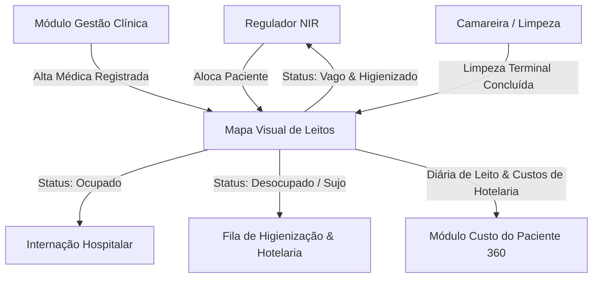

# Arquitetura Técnica de Módulo: Gestão de Leitos & Censo Hospitalar (Módulo 07)

## 1. Visão Geral do Bounded Context
O módulo **Gestão de Leitos & Censo Hospitalar (NIR)** é responsável pela regulação interna de vagas, gestão da hotelaria e higienização, controle da taxa de ocupação em tempo real e monitoramento do giro de leitos do hospital. Baseado na arquitetura do sistema **Bahmni Core** e nas diretrizes da **Portaria GM/MS nº 3.390/2013 (PNHOSP / Núcleo Interno de Regulação - NIR)**.

### Diagrama de Fronteira de Contexto


---

## 2. Perfis e Governança RBAC Individualizada

| Perfil de Acesso | Tipo | Escopo e Responsabilidades |
| :--- | :---: | :--- |
| **`leitos_camareira_higienizacao`** | Operacional | • Acesso à fila móvel de quartos aguardando limpeza (concorrente ou terminal).<br>• Registro do horário de início e fim da higienização com disparo de cronômetro de SLA.<br>• Liberação do leito como **Vago e Higienizado** para a regulação. |
| **`leitos_regulador_nir`** | Regulação / Assistencial | • Núcleo Interno de Regulação (NIR): visualização global do mapa de leitos da instituição.<br>• Alocação de leitos conforme perfil clínico, gravidade, sexo e necessidades de isolamento (contato, respiratório, reverso).<br>• Autorização de transferências internas de leito (ex: UTI ➔ Enfermaria). |
| **`leitos_coordenador_enfermagem_admin`** | Administrador do Módulo | • Cadastro da estrutura física hospitalar (blocos, andares, postos, enfermarias e leitos).<br>• Gestão de bloqueios temporários de leitos para manutenção predial ou reformas.<br>• Auditoria de indicadores de hotelaria: **Taxa de Ocupação**, **Tempo Médio de Permanência (TMP)** e **Intervalo de Substituição de Leito**. |

---

## 3. Modelo de Dados (Supabase `oogpcdaosexarxmvupiw`)

```sql
-- Unidades e Alas de Internação
CREATE TABLE IF NOT EXISTS satelites.unidades_internacao (
    id UUID PRIMARY KEY DEFAULT gen_random_uuid(),
    tenant_id UUID NOT NULL,
    codigo_ala VARCHAR(50) NOT NULL UNIQUE,
    nome_ala VARCHAR(100) NOT NULL, -- Ex: UTI Adulto, Enfermaria Cirúrgica, Pediatria
    tipo_ala VARCHAR(50) NOT NULL CHECK (tipo_ala IN ('uti', 'semi_intensiva', 'enfermaria', 'apartamento', 'isolamento', 'recuperacao_pos_anestesica')),
    total_leitos INT NOT NULL DEFAULT 0,
    ativo BOOLEAN DEFAULT TRUE
);

-- Leitos Físicos Hospitalares
CREATE TABLE IF NOT EXISTS satelites.leitos_hospitalares (
    id UUID PRIMARY KEY DEFAULT gen_random_uuid(),
    unidade_id UUID NOT NULL REFERENCES satelites.unidades_internacao(id) ON DELETE CASCADE,
    codigo_leito VARCHAR(30) NOT NULL UNIQUE, -- Ex: UTI-01, ENF-204-A
    status_leito VARCHAR(30) DEFAULT 'vago' CHECK (status_leito IN ('vago', 'ocupado', 'em_higienizacao', 'manutencao', 'bloqueado_isolamento', 'reservado')),
    paciente_atual_id UUID,
    atendimento_atual_id UUID,
    data_hora_ocupacao TIMESTAMPTZ,
    tipo_isolamento VARCHAR(30) DEFAULT 'nenhum' CHECK (tipo_isolamento IN ('nenhum', 'contato', 'aerossol', 'goticulas', 'protetor_reverso')),
    custo_diaria_hotelaria NUMERIC(10,2) NOT NULL DEFAULT 250.00
);

-- Histórico de Internações e Censo Hospitalar
CREATE TABLE IF NOT EXISTS satelites.internacoes_leito (
    id UUID PRIMARY KEY DEFAULT gen_random_uuid(),
    leito_id UUID NOT NULL REFERENCES satelites.leitos_hospitalares(id),
    paciente_id UUID NOT NULL,
    atendimento_id UUID NOT NULL,
    data_hora_admissao TIMESTAMPTZ NOT NULL,
    data_hora_alta TIMESTAMPTZ,
    motivo_saida VARCHAR(50) CHECK (motivo_saida IN ('alta_curada', 'alta_melhorada', 'transferencia_interna', 'transferencia_externa', 'evasao', 'obito')),
    dias_permanencia NUMERIC(5,2),
    regulador_responsavel VARCHAR(150) NOT NULL
);

-- Chamados e SLAs de Higienização de Leito
CREATE TABLE IF NOT EXISTS satelites.chamados_higienizacao (
    id UUID PRIMARY KEY DEFAULT gen_random_uuid(),
    leito_id UUID NOT NULL REFERENCES satelites.leitos_hospitalares(id),
    tipo_limpeza VARCHAR(30) NOT NULL CHECK (tipo_limpeza IN ('terminal_alta', 'concorrente_diaria', 'desinfeccao_isolamento')),
    solicitado_em TIMESTAMPTZ DEFAULT NOW(),
    inicio_limpeza TIMESTAMPTZ,
    fim_limpeza TIMESTAMPTZ,
    tempo_total_minutos INT,
    camareira_responsavel VARCHAR(150),
    status_chamado VARCHAR(30) DEFAULT 'pendente' CHECK (status_chamado IN ('pendente', 'em_execucao', 'concluido', 'cancelado'))
);
```

---

## 4. Regras de Negócio Críticas
1. **RN-LEI-01 (Transição Automática pós-Alta)**: No momento em que o médico registra a alta no PEP, o status do leito migra atomicamente de `ocupado` para `em_higienizacao`, e uma ordem de serviço de limpeza terminal é despachada para as camareiras.
2. **RN-LEI-02 (Barreira Sanitária de Isolamento)**: Um leito com flag de isolamento ativo não pode receber pacientes com patologias incompatíveis, travando a seleção na tela do NIR.
3. **RN-LEI-03 (Contabilização de Diárias Hospitalares)**: O sistema fecha a contagem da diária hospitalar às 00:00 de cada dia, somando os custos diretos de hotelaria e equipe multiprofissional ao episódio do paciente.

---

## 5. Contratos de Integração & Eventos
- **Evento Emitido**: `leitos.diaria_fechada` ➔ Envia apropriação do custo de diária de acomodação para o **Módulo 12 (Custo do Paciente 360)**.
- **Evento Consumido**: `clinica.alta_confirmada` ➔ Dispara a higienização do leito e atualiza o censo hospitalar.
