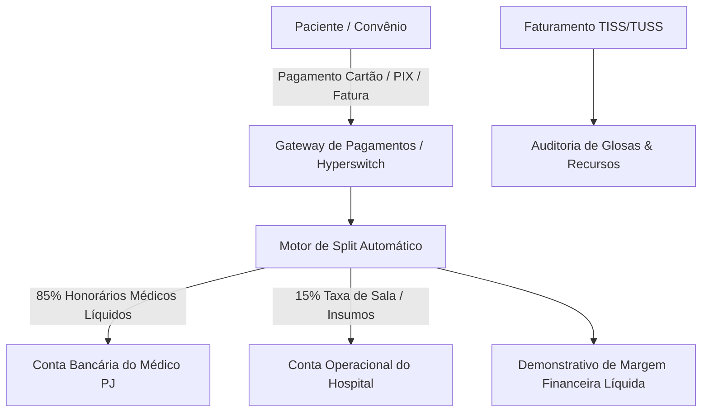

# Arquitetura Técnica de Módulo: Fintech & Split de Pagamento Hospitalar (Módulo 08)

## 1. Visão Geral do Bounded Context
O módulo **Fintech & Split de Pagamento Hospitalar** processa a liquidação financeira de receitas e honorários médicos, faturamento de convênios de saúde (padrão TISS/TUSS), faturamento SUS (BPA/APAC) e o mecanismo de **Split Automático de Pagamentos (85% Médico PJ / 15% Taxa de Sala Hospitalar)**, garantindo conformidade tributária e segurança de liquidação. Inspirado no roteador de pagamentos open-source **Hyperswitch** e nas resoluções do **Banco Central do Brasil**.

### Diagrama de Fronteira de Contexto


---

## 2. Perfis e Governança RBAC Individualizada

| Perfil de Acesso | Tipo | Escopo e Responsabilidades |
| :--- | :---: | :--- |
| **`financeiro_faturista`** | Operacional | • Lançamento de despesas particulares, coparticipações e procedimentos cirúrgicos.<br>• Fechamento de contas hospitalares e emissão de guias no padrão **TISS/TUSS**.<br>• Geração de cobranças digitais com **PIX Dinâmico com QR Code** e cartão de crédito. |
| **`financeiro_auditor_contas`** | Auditoria | • Confronto entre a prescrição/administração no prontuário e os itens lançados na fatura.<br>• Análise de demonstrativos de pagamento de operadoras e gestão de **Glosas Técnicas e Administrativas**.<br>• Protocolo eletrônico de recursos de glosas e conciliação bancária automática de recebíveis. |
| **`financeiro_diretor_cfo_admin`** | Administrador do Módulo | • Parametrização das regras de **Split de Pagamentos** por especialidade e equipe médica (ex: 85/15, 80/20, 70/30).<br>• Homologação de lotes de repasse e liquidação bancária aos prestadores PJ.<br>• Gestão do fluxo de caixa, margem de contribuição hospitalar e DRE consolidado da instituição. |

---

## 3. Modelo de Dados (Supabase `oogpcdaosexarxmvupiw`)

```sql
-- Faturas e Contas Hospitalares
CREATE TABLE IF NOT EXISTS satelites.faturas_hospitalares (
    id UUID PRIMARY KEY DEFAULT gen_random_uuid(),
    tenant_id UUID NOT NULL,
    numero_fatura VARCHAR(50) NOT NULL UNIQUE,
    atendimento_id UUID NOT NULL,
    paciente_id UUID NOT NULL,
    tipo_pagador VARCHAR(50) NOT NULL CHECK (tipo_pagador IN ('particular', 'convenio_saude', 'sus_apac_bpa', 'empresa_parceira')),
    operadora_nome VARCHAR(150),
    valor_total_bruto NUMERIC(15,2) NOT NULL,
    valor_glosado NUMERIC(15,2) DEFAULT 0.00,
    valor_liquido_recebido NUMERIC(15,2) DEFAULT 0.00,
    status_fatura VARCHAR(30) DEFAULT 'em_aberto' CHECK (status_fatura IN ('em_aberto', 'faturada_tiss', 'paga_parcial', 'liquidada_total', 'glosada_recursada', 'cancelada')),
    criado_em TIMESTAMPTZ DEFAULT NOW(),
    liquidado_em TIMESTAMPTZ
);

-- Regras de Split de Pagamento por Especialidade/Procedimento
CREATE TABLE IF NOT EXISTS satelites.regras_split_medico (
    id UUID PRIMARY KEY DEFAULT gen_random_uuid(),
    tenant_id UUID NOT NULL,
    codigo_regra VARCHAR(50) NOT NULL UNIQUE,
    descricao_regra VARCHAR(150) NOT NULL,
    percentual_medico NUMERIC(5,2) NOT NULL DEFAULT 85.00, -- Ex: 85%
    percentual_hospital NUMERIC(5,2) NOT NULL DEFAULT 15.00, -- Ex: 15%
    taxa_administracao_fixa NUMERIC(10,2) DEFAULT 0.00,
    ativo BOOLEAN DEFAULT TRUE
);

-- Transações de Split Financeiro Executadas
CREATE TABLE IF NOT EXISTS satelites.transacoes_split (
    id UUID PRIMARY KEY DEFAULT gen_random_uuid(),
    fatura_id UUID NOT NULL REFERENCES satelites.faturas_hospitalares(id) ON DELETE CASCADE,
    regra_split_id UUID NOT NULL REFERENCES satelites.regras_split_medico(id),
    medico_pj_cnpj VARCHAR(18) NOT NULL,
    medico_pj_razao_social VARCHAR(255) NOT NULL,
    valor_transacao_total NUMERIC(15,2) NOT NULL,
    valor_repasse_medico NUMERIC(15,2) NOT NULL,
    valor_retencao_hospitalar NUMERIC(15,2) NOT NULL,
    status_split VARCHAR(30) DEFAULT 'pendente' CHECK (status_split IN ('pendente', 'liquidado_banco', 'bloqueado_auditoria', 'estornado')),
    comprovante_bancario_id VARCHAR(100),
    data_liquidacao TIMESTAMPTZ
);

-- Auditoria e Recursos de Glosas Hospitalares
CREATE TABLE IF NOT EXISTS satelites.recursos_glosas (
    id UUID PRIMARY KEY DEFAULT gen_random_uuid(),
    fatura_id UUID NOT NULL REFERENCES satelites.faturas_hospitalares(id),
    codigo_glosa VARCHAR(20) NOT NULL,
    descricao_motivo TEXT NOT NULL,
    valor_glosado NUMERIC(15,2) NOT NULL,
    valor_recuperado NUMERIC(15,2) DEFAULT 0.00,
    status_recurso VARCHAR(30) DEFAULT 'em_analise' CHECK (status_recurso IN ('em_analise', 'aceito_operadora', 'rejeitado_definitivo')),
    auditor_responsavel VARCHAR(150) NOT NULL,
    criado_em TIMESTAMPTZ DEFAULT NOW()
);
```

---

## 4. Regras de Negócio Críticas
1. **RN-FIN-01 (Divisão Tributária em Momento Zero)**: O split de pagamento deve segregar contabilmente as contas no momento da transação adquirente, impedindo que os 85% de honorários médicos componham a base de faturamento bruto próprio do hospital para fins de PIS/COFINS/ISS.
2. **RN-FIN-02 (Trava de Glosa em Repasses Médicos)**: Caso uma fatura sofra glosa técnica por falha no preenchimento do prontuário médico, o repasse proporcional correspondente fica retido em `bloqueado_auditoria` até o desfecho do recurso.
3. **RN-FIN-03 (Liquidação Automática via PIX Banco Central)**: Faturas particulares pagas por PIX acionam webhook instantâneo liquidando a taxa do hospital e transferindo a cota médica em D+0.

---

## 5. Contratos de Integração & Eventos
- **Evento Emitido**: `financeiro.receita_liquidada` ➔ Envia os valores de receita e margem líquida para o **Módulo 12 (Custo do Paciente 360)**.
- **Evento Consumido**: `clinica.atendimento_encerrado` ➔ Consolida automaticamente todos os insumos, exames e honorários na fatura do paciente.
