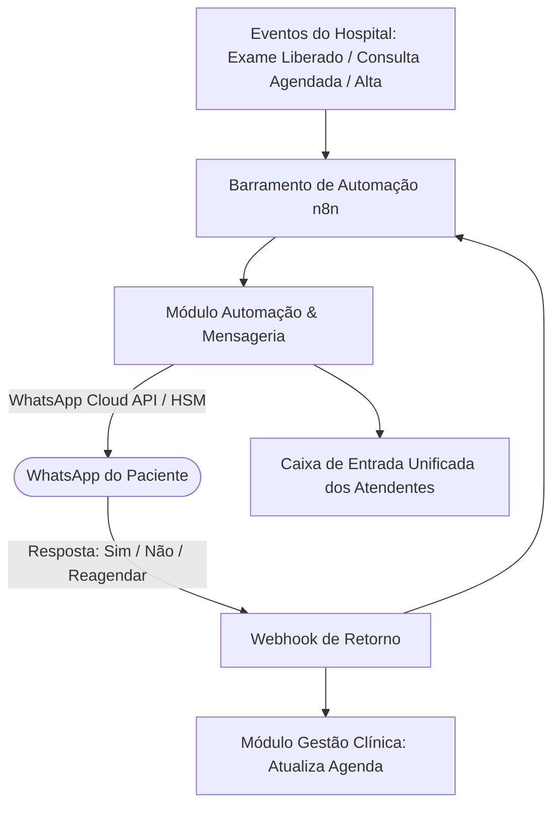

# Arquitetura Técnica de Módulo: Automação & Mensageria Multicanal (Módulo 09)

## 1. Visão Geral do Bounded Context
O módulo **Automação & Mensageria Multicanal** é a camada de comunicação humanizada e ativa com o cidadão/paciente e equipes assistenciais. Utilizando a infraestrutura do **WhatsApp Cloud API**, **Poli** e orquestrador **n8n**, ele executa réguas de relacionamento hospitalar: confirmação ativa de agendamentos com 1 toque, envio de links com autenticação segura para visualização de laudos laboratoriais, orientações de preparo cirúrgico e pesquisa de satisfação pós-alta (NPS), em total conformidade com a **LGPD**.

### Diagrama de Fronteira de Contexto


---

## 2. Perfis e Governança RBAC Individualizada

| Perfil de Acesso | Tipo | Escopo e Responsabilidades |
| :--- | :---: | :--- |
| **`comunicacao_atendente`** | Operacional | • Atendimento de suporte na caixa de entrada compartilhada do WhatsApp institucional.<br>• Resposta a dúvidas frequentes sobre preparo de exames laboratoriais e jejum cirúrgico.<br>• Reagendamento de consultas mediante solicitação direta do paciente pelo chat. |
| **`comunicacao_gestor_campanhas_admin`** | Administrador do Módulo | • Criação e aprovação de templates oficiais de mensagens (HSM Meta) junto à provedora.<br>• Configuração e ativação de **Réguas de Disparo Automatizado** (D-2 aviso de consulta, D-1 confirmação, H+2 laudo liberado, D+1 pesquisa NPS).<br>• Gestão de permissões de consentimento (opt-in/opt-out), taxa de entrega e auditoria LGPD. |

---

## 3. Modelo de Dados (Supabase `oogpcdaosexarxmvupiw`)

```sql
-- Templates de Mensagens Homologados (WhatsApp HSM)
CREATE TABLE IF NOT EXISTS satelites.templates_mensagens (
    id UUID PRIMARY KEY DEFAULT gen_random_uuid(),
    tenant_id UUID NOT NULL,
    nome_identificador VARCHAR(100) NOT NULL UNIQUE,
    categoria VARCHAR(50) NOT NULL CHECK (categoria IN ('utilidade_publica', 'confirmacao_agenda', 'resultado_exame', 'orientacao_cirurgica', 'pesquisa_satisfacao')),
    corpo_template TEXT NOT NULL, -- "Olá {{nome}}, confirmamos sua consulta com {{medico}} amanhã às {{hora}}."
    botoes_acao JSONB, -- [{"tipo": "quick_reply", "texto": "Confirmar"}, {"tipo": "quick_reply", "texto": "Reagendar"}]
    status_aprovacao_meta VARCHAR(30) DEFAULT 'aprovado' CHECK (status_aprovacao_meta IN ('rascunho', 'submetido', 'aprovado', 'rejeitado')),
    ativo BOOLEAN DEFAULT TRUE
);

-- Fila de Disparos e Transações de Mensagens
CREATE TABLE IF NOT EXISTS satelites.filas_disparos_whatsapp (
    id UUID PRIMARY KEY DEFAULT gen_random_uuid(),
    tenant_id UUID NOT NULL,
    paciente_id UUID NOT NULL,
    telefone_destinatario VARCHAR(20) NOT NULL,
    template_id UUID NOT NULL REFERENCES satelites.templates_mensagens(id),
    variaveis_payload JSONB NOT NULL,
    data_hora_agendada TIMESTAMPTZ DEFAULT NOW(),
    status_envio VARCHAR(30) DEFAULT 'enfileirado' CHECK (status_envio IN ('enfileirado', 'enviado', 'entregue', 'lido', 'falha_envio', 'respondido_confirmado', 'respondido_cancelado')),
    id_mensagem_meta VARCHAR(100),
    erro_detalhe TEXT,
    atualizado_em TIMESTAMPTZ DEFAULT NOW()
);

-- Conversas e Histórico de Atendimento Humanizado
CREATE TABLE IF NOT EXISTS satelites.conversas_atendimento (
    id UUID PRIMARY KEY DEFAULT gen_random_uuid(),
    paciente_id UUID NOT NULL,
    telefone VARCHAR(20) NOT NULL,
    atendente_responsavel VARCHAR(150),
    status_conversa VARCHAR(30) DEFAULT 'aberta' CHECK (status_conversa IN ('aberta', 'em_atendimento', 'aguardando_paciente', 'resolvida_fechada')),
    iniciada_em TIMESTAMPTZ DEFAULT NOW(),
    fechada_em TIMESTAMPTZ
);
```

---

## 4. Regras de Negócio Críticas
1. **RN-MSG-01 (Janela de Atendimento e Opt-Out LGPD)**: Caso o paciente envie comando "PARAR" ou "SAIR", o sistema marca o número com revogação formal de consentimento e bloqueia disparos de réguas ativas.
2. **RN-MSG-02 (Atualização Automática da Fila Médica)**: Se o paciente clica no botão "Confirmar" no WhatsApp, o agendamento no módulo de Gestão Clínica (Módulo 05) passa instantaneamente para `confirmado_paciente`.
3. **RN-MSG-03 (Segurança no Acesso ao Laudo)**: A mensagem contendo resultado de exame não trafega dados clínicos abertos no chat. Ela envia um link curto que exige validação dos 4 primeiros dígitos do CPF e data de nascimento do paciente para decifrar o laudo.

---

## 5. Contratos de Integração & Eventos
- **Evento Emitido**: `mensageria.consulta_confirmada` ➔ Atualiza a escala e grade ambulatorial no **Módulo 05 (Gestão Clínica)**.
- **Evento Consumido**: `laboratorio.laudo_liberado` ➔ Dispara notificação imediata com link criptografado do resultado ao paciente.
