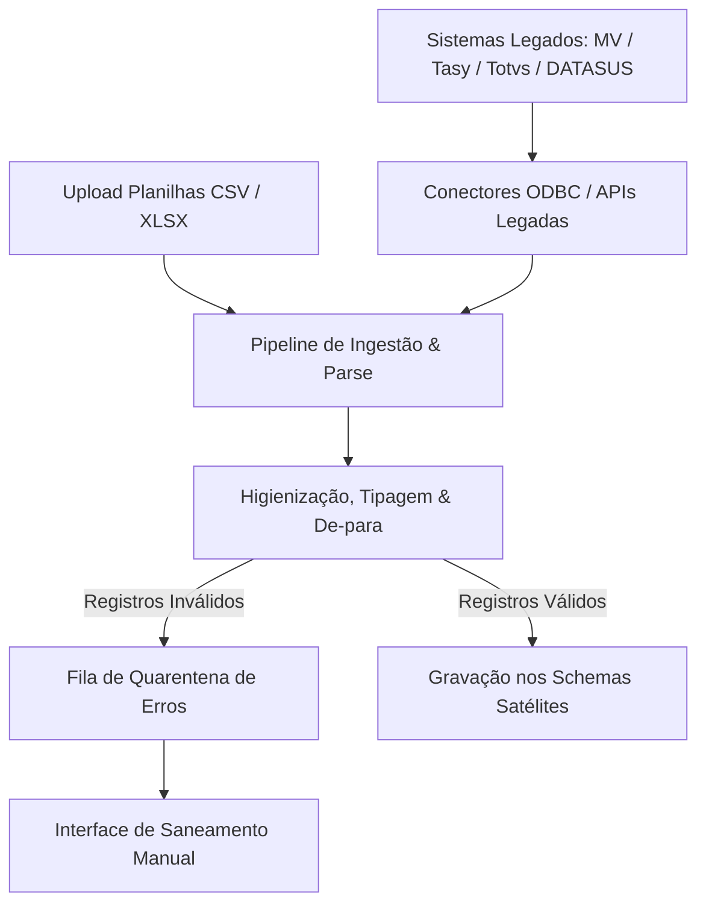

# Arquitetura Técnica de Módulo: Ingestão de Dados & Conectores Legados (Módulo 10)

## 1. Visão Geral do Bounded Context
O módulo **Ingestão de Dados & Conectores Legados** atua como a **Anti-Corruption Layer (ACL)** e o barramento de interoperabilidade (ETL) do Hospital 360. Ele permite a importação assistida de dados em planilhas (CSV, XLSX), a comunicação com sistemas hospitalares legados de mercado (**MV Soul, Philips Tasy, Protheus Totvs**) e a sincronização com bases governamentais (**DATASUS, RNDS, CNES**), realizando saneamento de schemas, enriquecimento e quarentena de registros inconsistentes.

### Diagrama de Fronteira de Contexto


---

## 2. Perfis e Governança RBAC Individualizada

| Perfil de Acesso | Tipo | Escopo e Responsabilidades |
| :--- | :---: | :--- |
| **`integrador_dados`** | Operacional | • Upload de arquivos legados (cadastros de pacientes, estoques, tabelas de procedimentos).<br>• Mapeamento assistido das colunas da planilha para o modelo relacional oficial.<br>• Correção e saneamento manual de linhas que caíram na fila de quarentena. |
| **`integrador_admin_ti`** | Administrador do Módulo | • Configuração de conectores de banco legado, webhooks e agendamento de jobs de sincronização periódica (cron).<br>• Monitoramento de dead-letter queues e métricas de desempenho de pipelines ETL.<br>• Definição de regras de idempotência e resolução de conflitos de chave primária entre o sistema legado e o Hospital 360. |

---

## 3. Modelo de Dados (Supabase `oogpcdaosexarxmvupiw`)

```sql
-- Lotes de Arquivos de Ingestão
CREATE TABLE IF NOT EXISTS satelites.arquivos_ingestao (
    id UUID PRIMARY KEY DEFAULT gen_random_uuid(),
    tenant_id UUID NOT NULL,
    nome_arquivo_original VARCHAR(255) NOT NULL,
    tipo_origem VARCHAR(50) NOT NULL CHECK (tipo_origem IN ('csv_upload', 'xlsx_upload', 'conector_mv', 'conector_tasy', 'api_datasus')),
    entidade_destino VARCHAR(100) NOT NULL, -- pacientes, estoques, escalas, faturas
    total_linhas INT NOT NULL DEFAULT 0,
    linhas_processadas INT NOT NULL DEFAULT 0,
    linhas_com_erro INT NOT NULL DEFAULT 0,
    status_processamento VARCHAR(30) DEFAULT 'em_processamento' CHECK (status_processamento IN ('recebido', 'em_processamento', 'concluido_sucesso', 'concluido_com_erros', 'falha_fatal')),
    carregado_por VARCHAR(150) NOT NULL,
    criado_em TIMESTAMPTZ DEFAULT NOW(),
    concluido_em TIMESTAMPTZ
);

-- Fila de Quarentena de Linhas Rejeitadas
CREATE TABLE IF NOT EXISTS satelites.erros_ingestao_dados (
    id UUID PRIMARY KEY DEFAULT gen_random_uuid(),
    arquivo_id UUID NOT NULL REFERENCES satelites.arquivos_ingestao(id) ON DELETE CASCADE,
    numero_linha INT NOT NULL,
    conteudo_linha_raw JSONB NOT NULL,
    campo_divergente VARCHAR(100) NOT NULL,
    motivo_erro TEXT NOT NULL, -- Ex: CPF inválido, Data fora do padrão, FK inexistente
    status_resolucao VARCHAR(30) DEFAULT 'pendente' CHECK (status_resolucao IN ('pendente', 'corrigido_reprocessado', 'ignorado')),
    corrigido_por VARCHAR(150),
    corrigido_em TIMESTAMPTZ
);

-- Configurações de Conectores Legados
CREATE TABLE IF NOT EXISTS satelites.conectores_legados_config (
    id UUID PRIMARY KEY DEFAULT gen_random_uuid(),
    tenant_id UUID NOT NULL,
    sistema_legado_nome VARCHAR(100) NOT NULL, -- MV Soul, Tasy, Protheus
    tipo_conexao VARCHAR(50) NOT NULL CHECK (tipo_conexao IN ('rest_api', 'soap_xml', 'postgres_fdw', 'sftp')),
    endereco_host VARCHAR(255) NOT NULL,
    credencial_secret_name VARCHAR(100) NOT NULL,
    intervalo_sincronizacao_minutos INT DEFAULT 60,
    ativo BOOLEAN DEFAULT TRUE,
    ultima_sincronizacao TIMESTAMPTZ
);
```

---

## 4. Regras de Negócio Críticas
1. **RN-ING-01 (Transacionalidade Isolada em Lote)**: Erros em linhas isoladas de uma planilha não abortam o processamento das linhas válidas; linhas defeituosas são desviadas para a tabela de quarentena (`erros_ingestao_dados`).
2. **RN-ING-02 (Validação Sintática e Semântica de CPF/CNS)**: Nenhum registro de paciente é persistido no schema `public.pacientes` sem validação matemática do dígito verificador do CPF e conferência no formato do Cartão Nacional de Saúde (CNS).
3. **RN-ING-03 (Idempotência Obrigatória)**: Ingestões repetidas do mesmo lote de dados utilizam deduplicação por hash de conteúdo ou chave de negócio, impedindo duplicidade de faturas ou movimentações de estoque.

---

## 5. Contratos de Integração & Eventos
- **Evento Emitido**: `ingestao.lote_concluido` ➔ Notifica os módulos de destino que novas cargas de dados consolidados estão prontas para consumo.
