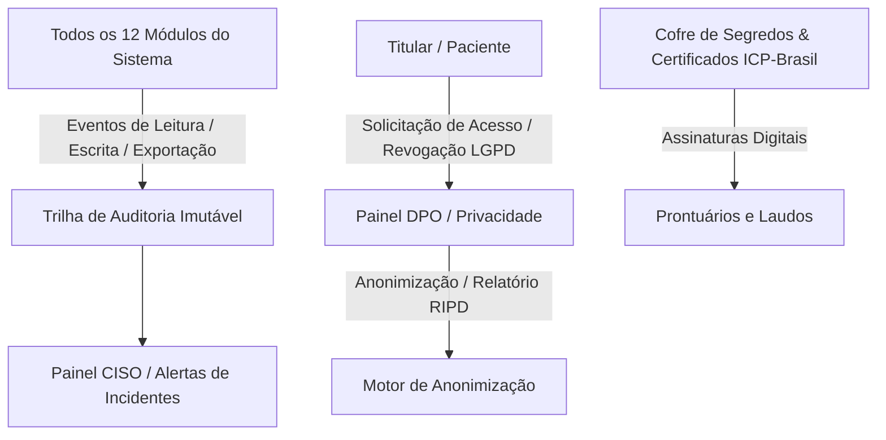

# Arquitetura Técnica de Módulo: Blindagem de Segurança & Privacidade (Módulo 11)

## 1. Visão Geral do Bounded Context
O módulo **Blindagem de Segurança & Privacidade** implementa a governança de cibersegurança, gestão de credenciais e custódia de dados sensíveis de saúde do ecossistema Hospital 360. Ele atua conforme a **Lei Geral de Proteção de Dados (LGPD - Lei nº 13.709/2018)**, o **Marco Civil da Internet**, a **Resolução CFM nº 1.821/07** e os princípios da metodologia operacional **CRED-OMEGA**, fornecendo trilhas de auditoria imutáveis, cofre de certificados digitais e atendimento aos direitos dos titulares de dados.

### Diagrama de Fronteira de Contexto


---

## 2. Perfis e Governança RBAC Individualizada

| Perfil de Acesso | Tipo | Escopo e Responsabilidades |
| :--- | :---: | :--- |
| **`dpo_privacidade`** | Governança | • Atendimento aos direitos dos titulares de dados (confirmação de tratamento, anonimização, revogação de consentimento).<br>• Geração do **Relatório de Impacto à Proteção de Dados Pessoais Sensíveis (RIPD)**.<br>• Auditoria de políticas de retenção temporal e expiração de dados legados. |
| **`seguranca_ciso_admin`** | Administrador do Módulo | • Gestão do **Cofre de Segredos e Certificados**: rotação de chaves de API, certificados digitais ICP-Brasil e tokens de integração.<br>• Consulta à **Trilha de Auditoria Imutável**: rastreio de todo acesso aos prontuários clínicos (Quem, Quando, Qual Paciente, IP de Origem e Justificativa).<br>• Parametrização de políticas de bloqueio por força bruta, mTLS, isolamento de schemas e integridade do PostgreSQL. |

---

## 3. Modelo de Dados (Supabase `oogpcdaosexarxmvupiw`)

```sql
-- Trilha de Auditoria Imutável de Acesso a Dados Clínicos
CREATE TABLE IF NOT EXISTS satelites.logs_auditoria_acesso (
    id UUID PRIMARY KEY DEFAULT gen_random_uuid(),
    tenant_id UUID NOT NULL,
    usuario_id UUID NOT NULL,
    usuario_email VARCHAR(150) NOT NULL,
    usuario_perfil VARCHAR(50) NOT NULL,
    tipo_operacao VARCHAR(30) NOT NULL CHECK (tipo_operacao IN ('leitura_prontuario', 'escrita_evolucao', 'exportacao_relatorio', 'alteracao_permissao', 'exclusao_logica')),
    recurso_acessado VARCHAR(100) NOT NULL, -- Ex: prontuario_paciente_123, laudo_laboratorial_456
    paciente_id UUID,
    ip_origem VARCHAR(45) NOT NULL,
    user_agent TEXT,
    justificativa_acesso VARCHAR(255),
    data_hora TIMESTAMPTZ DEFAULT NOW()
);

-- Cofre de Metadados de Segredos e Certificados Digitais
CREATE TABLE IF NOT EXISTS satelites.cofre_segredos_metadata (
    id UUID PRIMARY KEY DEFAULT gen_random_uuid(),
    tenant_id UUID NOT NULL,
    nome_segredo VARCHAR(100) NOT NULL UNIQUE,
    tipo_segredo VARCHAR(50) NOT NULL CHECK (tipo_segredo IN ('certificado_icp_brasil', 'token_api_externa', 'chave_webhook', 'senha_conector_legado')),
    valido_ate TIMESTAMPTZ,
    status VARCHAR(30) DEFAULT 'ativo' CHECK (status IN ('ativo', 'expirado', 'revogado')),
    responsavel_cadastro VARCHAR(150) NOT NULL,
    cadastrado_em TIMESTAMPTZ DEFAULT NOW(),
    ultima_rotacao TIMESTAMPTZ
);

-- Gestão de Solicitações de Titulares LGPD
CREATE TABLE IF NOT EXISTS satelites.solicitacoes_titulares_lgpd (
    id UUID PRIMARY KEY DEFAULT gen_random_uuid(),
    tenant_id UUID NOT NULL,
    paciente_id UUID NOT NULL,
    protocolo_solicitacao VARCHAR(50) NOT NULL UNIQUE,
    tipo_pedido VARCHAR(50) NOT NULL CHECK (tipo_pedido IN ('acesso_dados', 'portabilidade', 'anonimizacao', 'revogacao_consentimento', 'retificacao')),
    status_atendimento VARCHAR(30) DEFAULT 'aberto' CHECK (status_atendimento IN ('aberto', 'em_analise_juridica', 'concluido', 'indeferido_base_legal')),
    parecer_dpo TEXT,
    solicitado_em TIMESTAMPTZ DEFAULT NOW(),
    respondido_em TIMESTAMPTZ
);
```

---

## 4. Regras de Negócio Críticas
1. **RN-SEG-01 (Imutabilidade Rígida de Auditoria)**: A tabela `satelites.logs_auditoria_acesso` opera sob diretriz WORM (Write Once, Read Many). Nenhuma operação de `UPDATE` ou `DELETE` é permitida, sob qualquer perfil (incluindo administradores).
2. **RN-SEG-02 (Alerta de Quebra de Sigilo)**: Caso um mesmo usuário consulte mais de 20 prontuários de pacientes distintos em menos de 5 minutos fora da sua escala médica ativa, o sistema emite alerta crítico no painel do CISO e bloqueia temporariamente a sessão para auditoria.
3. **RN-SEG-03 (Proteção de Dados Sensíveis na Anonimização)**: Solicitações de anonimização acolhidas mantêm apenas dados epidemiológicos e financeiros agregados, substituindo CPF, Nome, Telefone e Endereço por hashes pseudo-aleatórios irreversíveis, em harmonia com as obrigações de guarda do CFM (prazo mínimo de 20 anos em prontuário).

---

## 5. Contratos de Integração & Eventos
- **Evento Consumido**: Todos os módulos despacham chamadas assíncronas para registro em `satelites.logs_auditoria_acesso`.
- **Serviço Provido**: Validação de chaves e controle de acesso para todos os 11 módulos do ecossistema.
