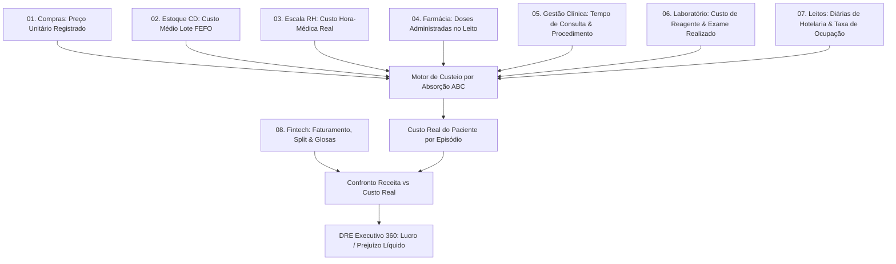

# Arquitetura Técnica de Módulo: Dashboard Executivo & Custo do Paciente 360 (Módulo 12)

## 1. Visão Geral do Bounded Context
O módulo **Dashboard Executivo & Custo do Paciente 360** é o ápice integrador e a inteligência financeira máxima do ecossistema. Ele consolida os fluxos de todos os outros 11 módulos através de um **Motor de Custeio por Absorção Plena e ABC (Activity-Based Costing)** estruturado em **5 Estações de Cuidado Clínico**. O módulo permite saber com precisão de centavos o custo real incorrido em cada paciente e confrontar esse custo contra a receita efetivamente recebida (Tabela SUS/SIGTAP ou Convênios/TUSS), gerando o **Demonstrativo de Lucro/Prejuízo Líquido por Paciente e Episódio**.

### Diagrama de Fronteira de Contexto


---

## 2. Perfis e Governança RBAC Individualizada

| Perfil de Acesso | Tipo | Escopo e Responsabilidades |
| :--- | :---: | :--- |
| **`executivo_auditor_custos`** | Técnico / Controladoria | • Auditoria detalhada da apropriação de custos diretos de cada paciente.<br>• Parametrização e conferência das taxas de rateio de custos indiretos das 5 estações.<br>• Identificação de discrepâncias entre insumos prescritos versus insumos efetivamente baixados e faturados. |
| **`executivo_diretor_geral_ceo`** | Administrador Executivo | • Visão holística da rentabilidade hospitalar em tempo real.<br>• **Drill-down de Custo por Paciente**: análise cirúrgica de episódios clínicos superavitários ou deficitários.<br>• Avaliação de rentabilidade por linha de cuidado, especialidade médica, médico assistente e operadora pagadora.<br>• Tomada de decisão estratégica sobre renegociação de tabelas e descontinuação de procedimentos com margem negativa crônica. |

---

## 3. Modelo de Dados (Supabase `oogpcdaosexarxmvupiw`)

```sql
-- Pacientes e Cadastro Central
CREATE TABLE IF NOT EXISTS public.pacientes (
    id UUID PRIMARY KEY DEFAULT gen_random_uuid(),
    tenant_id UUID NOT NULL,
    cns VARCHAR(15), -- Cartão Nacional de Saúde
    cpf VARCHAR(14) NOT NULL UNIQUE,
    nome_completo VARCHAR(200) NOT NULL,
    data_nascimento DATE NOT NULL,
    sexo VARCHAR(20) NOT NULL,
    nome_mae VARCHAR(200),
    telefone VARCHAR(20),
    municipio_residencia VARCHAR(150),
    criado_em TIMESTAMPTZ DEFAULT NOW(),
    atualizado_em TIMESTAMPTZ DEFAULT NOW()
);

-- Episódios Clínicos (A Jornada do Paciente)
CREATE TABLE IF NOT EXISTS public.episodios (
    id UUID PRIMARY KEY DEFAULT gen_random_uuid(),
    tenant_id UUID NOT NULL,
    paciente_id UUID NOT NULL REFERENCES public.pacientes(id) ON DELETE CASCADE,
    numero_episodio VARCHAR(50) NOT NULL UNIQUE,
    data_inicio TIMESTAMPTZ NOT NULL DEFAULT NOW(),
    data_fim TIMESTAMPTZ,
    tipo_episodio VARCHAR(50) NOT NULL CHECK (tipo_episodio IN ('ambulatorio', 'pronto_atendimento', 'internacao_clinica', 'internacao_cirurgica', 'uti')),
    cid_principal VARCHAR(10),
    status VARCHAR(30) DEFAULT 'aberto' CHECK (status IN ('aberto', 'encerrado', 'faturado_auditado', 'cancelado')),
    receita_total_prevista NUMERIC(15,2) DEFAULT 0.00,
    receita_total_liquidada NUMERIC(15,2) DEFAULT 0.00,
    custo_total_direto NUMERIC(15,2) DEFAULT 0.00,
    custo_total_indireto NUMERIC(15,2) DEFAULT 0.00,
    margem_liquida NUMERIC(15,2) DEFAULT 0.00 -- receita_liquidada - (custo_direto + custo_indireto)
);

-- Centros de Custo e Estações de Cuidado Hospitalar
CREATE TABLE IF NOT EXISTS public.centros_custo (
    id UUID PRIMARY KEY DEFAULT gen_random_uuid(),
    tenant_id UUID NOT NULL,
    codigo_estacao VARCHAR(50) NOT NULL UNIQUE, -- EST_01_TRIAGEM, EST_02_CONSULTORIO, EST_03_LABORATORIO, EST_04_FARMACIA, EST_05_LEITO
    nome_estacao VARCHAR(150) NOT NULL,
    tipo_custo VARCHAR(50) NOT NULL CHECK (tipo_custo IN ('direto', 'indireto_rateado')),
    metodologia_rateio VARCHAR(100) DEFAULT 'tempo_permanencia_minutos',
    custo_hora_estacao NUMERIC(10,2) NOT NULL DEFAULT 60.00,
    ativo BOOLEAN DEFAULT TRUE
);

-- Eventos de Custo Unitário Apropriados por Paciente (Motor de Absorção)
CREATE TABLE IF NOT EXISTS public.eventos_custo (
    id UUID PRIMARY KEY DEFAULT gen_random_uuid(),
    tenant_id UUID NOT NULL,
    episodio_id UUID NOT NULL REFERENCES public.episodios(id) ON DELETE CASCADE,
    paciente_id UUID NOT NULL REFERENCES public.pacientes(id),
    centro_custo_id UUID NOT NULL REFERENCES public.centros_custo(id),
    modulo_origem VARCHAR(50) NOT NULL, -- farmacia_estoque, laboratorio, escala_medica, leitos_censo, gestao_clinica
    referencia_item_id VARCHAR(100), -- ID do item dispensado ou exame ou plantão
    descricao_evento VARCHAR(255) NOT NULL,
    quantidade NUMERIC(10,2) NOT NULL DEFAULT 1.0,
    valor_custo_direto NUMERIC(15,4) NOT NULL,
    valor_custo_indireto_absorvido NUMERIC(15,4) NOT NULL DEFAULT 0.0000,
    valor_custo_total NUMERIC(15,4) NOT NULL,
    data_hora_evento TIMESTAMPTZ DEFAULT NOW(),
    auditoria_status VARCHAR(30) DEFAULT 'aprovado' CHECK (auditoria_status IN ('pendente', 'aprovado', 'glosado_interno'))
);
```

---

## 4. O Motor de Absorção nas 5 Estações de Cuidado

```
┌─────────────────────────────────────────────────────────────────────────────────┐
│              JORNADA DO PACIENTE: 5 ESTAÇÕES DE ABSORÇÃO DE CUSTOS              │
└─────────────────────────────────────────────────────────────────────────────────┘
  1. Estação Triagem        ➔ Custo de Enfermagem (minutos) + Insumos de Manchester
  2. Estação Consultório    ➔ Custo de Hora Médica Proporcional + Depreciação de Sala
  3. Estação Laboratório    ➔ Custo de Reagente Químico + Lâmina + Equipamento LIS
  4. Estação Farmácia       ➔ Custo Real do Medicamento FEFO + Kit de Infusão
  5. Estação Leito/Hotelaria➔ Diária do Leito + Higienização Terminal + Nutrição Clínica
───────────────────────────────────────────────────────────────────────────────────
  TOTAL CUSTO PACIENTE = ∑ (Custos Diretos) + ∑ (Custos Indiretos Rateados)
  MARGEM CONTRIBUIÇÃO  = Receita Faturada (TUSS/SUS) - TOTAL CUSTO PACIENTE
```

---

## 5. Regras de Negócio Críticas
1. **RN-EXE-01 (Cálculo Contínuo de Margem Líquida)**: Toda inserção na tabela `public.eventos_custo` dispara trigger de recálculo imediato do `custo_total_direto`, `custo_total_indireto` e `margem_liquida` na tabela `public.episodios`.
2. **RN-EXE-02 (Alerta de Episódio Deficitário)**: Se a soma de custos de um paciente internado ultrapassar a receita autorizada pela guia de convênio ou teto da AIH SUS, o sistema exibe badge de alerta vermelho no painel executivo para reavaliação clínica e autorização de prorrogação.
3. **RN-EXE-03 (Impossibilidade de Encerramento sem Auditoria de Custos)**: Um episódio não pode ser fechado como `faturado_auditado` enquanto houver itens de dispensação ou exames pendentes de consolidação de custo unitário.
