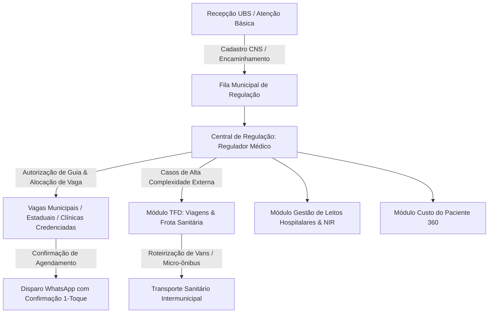

# Arquitetura Técnica de Módulo: Central de Regulação de Vagas & TFD (Módulo 13 - Base AIVO)

## 1. Visão Geral do Bounded Context
O módulo **Central de Regulação de Vagas & TFD (Tratamento Fora de Domicílio)** é o cérebro regulatório da rede de saúde pública municipal e regional, integrando os fluxos da rede básica (UBS), clínicas credenciadas, hospitais de referência e o transporte sanitário intermunicipal. 

Baseado na arquitetura do sistema **AIVO** (Mato Grosso do Sul / Ponta Porã / Campo Grande / Dourados), ele centraliza o gerenciamento de filas de espera por especialidade, guias de autorização (APAC/BPA), validação do Cartão Nacional de Saúde (**CADSUS / CNS**), disparo ativo de confirmações via WhatsApp e a operação logística do **TFD** (viagens, frota e roteirização de passageiros).

### Diagrama de Fronteira de Contexto


---

## 2. Perfis e Governança RBAC Individualizada (Matriz AIVO)

Conforme estabelecido na arquitetura AIVO, o módulo de regulação opera com **perfis e sidebars totalmente individualizados**:

| Perfil de Acesso | ID Interno | Escopo e Responsabilidades no Sistema |
| :--- | :---: | :--- |
| **`reg_gestor`** | `gestor` | • Gestão geral da regulação municipal, painel de KPIs e relatórios de absenteísmo.<br>• Upload em lote de listas de pacientes regulados.<br>• Credenciamento e auditoria de clínicas conveniadas e prestadores terceirizados.<br>• Configuração das regras do bot de WhatsApp. |
| **`reg_regulador_medico`** | `regulador` | • Central de Regulação: análise técnica e classificação de gravidade de pedidos de vaga.<br>• Gestão do painel de vagas por especialidade (municipal, estadual SISREG/REMISSUS e contratualizada).<br>• Emissão e despacho de **Guias de Autorização** (Pendente ➔ Aprovado ➔ Agendado ➔ Cancelado). |
| **`reg_recepcao_reg`** | `recep-reg` | • Agendamento direto de pacientes para consultas e exames de média/alta complexidade.<br>• Monitoramento em tempo real do status de confirmações do WhatsApp (Confirmado, Recusado, Sem Resposta).<br>• Remanejamento de vagas ociosas para pacientes da fila de espera. |
| **`reg_recepcao_ubs`** | `recep-ubs` | • Check-in presencial do paciente na Unidade Básica de Saúde no dia da consulta.<br>• Cadastro de pacientes com validação obrigatória do **Cartão SUS (CNS/CADSUS)**.<br>• Visualização da fila diária do posto de saúde e atribuição da senha de acolhimento. |
| **`reg_medico_ambulatorio`**| `medico` | • Portal do Médico: agenda do dia com status em tempo real de presença pela recepção.<br>• **Código de Validação Médica (Check-in Code)** para abertura do prontuário.<br>• Evolução clínica, prescrição, emissão de laudos e encaminhamentos com assinatura. |
| **`reg_agente_tfd`** | `tfd` | • **Gestão do Tratamento Fora de Domicílio (TFD)**: cadastro e aprovação de viagens intermunicipais de pacientes e acompanhantes.<br>• Controle de **Frota Sanitária** (ambulâncias, vans, micro-ônibus, vans adaptadas para cadeirantes).<br>• Roteirização de passageiros por data, destino e hospital de referência. |
| **`reg_admin_geral`** | Administrador do Módulo | • Parametrização dos tetos de vagas por cota municipal/estadual.<br>• Homologação de contratos com prestadores terceirizados.<br>• Auditoria de filas públicas em conformidade com as exigências do Ministério Público e SUS. |

---

## 3. Modelo de Dados (Supabase `oogpcdaosexarxmvupiw`)

```sql
-- Guias de Regulação e Solicitação de Vagas
CREATE TABLE IF NOT EXISTS satelites.guias_regulacao (
    id UUID PRIMARY KEY DEFAULT gen_random_uuid(),
    tenant_id UUID NOT NULL,
    numero_guia VARCHAR(50) NOT NULL UNIQUE,
    paciente_cns VARCHAR(15) NOT NULL,
    paciente_cpf VARCHAR(14) NOT NULL,
    paciente_nome VARCHAR(200) NOT NULL,
    especialidade_solicitada VARCHAR(100) NOT NULL, -- Cardiologia, Ortopedia, Oftalmologia, etc.
    procedimento_sigtap_codigo VARCHAR(20),
    unidade_origem_ubs VARCHAR(150) NOT NULL,
    medico_solicitante VARCHAR(150) NOT NULL,
    crm_solicitante VARCHAR(20) NOT NULL,
    urgencia VARCHAR(20) NOT NULL DEFAULT 'normal' CHECK (urgencia IN ('normal', 'preferencial', 'urgente', 'critico')),
    status_guia VARCHAR(30) DEFAULT 'pendente' CHECK (status_guia IN ('pendente', 'em_analise_medica', 'aprovada', 'agendada', 'rejeitada_justificada', 'cancelada')),
    clinica_destino_nome VARCHAR(150),
    data_hora_agendamento TIMESTAMPTZ,
    regulador_responsavel VARCHAR(150),
    parecer_regulador TEXT,
    criado_em TIMESTAMPTZ DEFAULT NOW(),
    atualizado_em TIMESTAMPTZ DEFAULT NOW()
);

-- Painel de Vagas Disponíveis por Especialidade
CREATE TABLE IF NOT EXISTS satelites.painel_vagas_regulacao (
    id UUID PRIMARY KEY DEFAULT gen_random_uuid(),
    tenant_id UUID NOT NULL,
    especialidade VARCHAR(100) NOT NULL,
    esfera VARCHAR(30) NOT NULL CHECK (esfera IN ('municipal', 'estadual_remissus', 'clinica_credenciada')),
    unidade_prestadora VARCHAR(150) NOT NULL,
    mes_competencia VARCHAR(7) NOT NULL, -- Ex: '2026-09'
    vagas_totais INT NOT NULL DEFAULT 0,
    vagas_consumidas INT NOT NULL DEFAULT 0,
    vagas_saldo INT NOT NULL DEFAULT 0,
    ativo BOOLEAN DEFAULT TRUE
);

-- Viagens do Tratamento Fora de Domicílio (TFD)
CREATE TABLE IF NOT EXISTS satelites.viagens_tfd (
    id UUID PRIMARY KEY DEFAULT gen_random_uuid(),
    tenant_id UUID NOT NULL,
    numero_viagem VARCHAR(50) NOT NULL UNIQUE,
    municipio_origem VARCHAR(100) NOT NULL DEFAULT 'Ponta Porã',
    municipio_destino VARCHAR(100) NOT NULL, -- Campo Grande, Dourados, etc.
    data_viagem DATE NOT NULL,
    horario_saida TIME NOT NULL,
    horario_retorno_previsto TIME,
    veiculo_placa VARCHAR(10) NOT NULL,
    veiculo_tipo VARCHAR(50) NOT NULL CHECK (veiculo_tipo IN ('van_passageiros', 'micro_onibus', 'ambulancia_uti', 'veiculo_leve')),
    motorista_nome VARCHAR(150) NOT NULL,
    motorista_telefone VARCHAR(20),
    capacidade_passageiros INT NOT NULL,
    passageiros_confirmados INT NOT NULL DEFAULT 0,
    status_viagem VARCHAR(30) DEFAULT 'agendada' CHECK (status_viagem IN ('agendada', 'em_transito', 'concluida', 'cancelada')),
    criado_em TIMESTAMPTZ DEFAULT NOW()
);

-- Passageiros Alocados no Roteiro TFD (Pacientes e Acompanhantes)
CREATE TABLE IF NOT EXISTS satelites.passageiros_tfd (
    id UUID PRIMARY KEY DEFAULT gen_random_uuid(),
    viagem_id UUID NOT NULL REFERENCES satelites.viagens_tfd(id) ON DELETE CASCADE,
    paciente_cns VARCHAR(15) NOT NULL,
    paciente_nome VARCHAR(200) NOT NULL,
    tipo_passageiro VARCHAR(20) NOT NULL CHECK (tipo_passageiro IN ('paciente', 'acompanhante_legal', 'doador')),
    hospital_destino VARCHAR(150) NOT NULL, -- Ex: Hospital Regional de MS, Santa Casa
    horario_procedimento TIME NOT NULL,
    precisa_cadeira_rodas BOOLEAN DEFAULT FALSE,
    precisa_maca BOOLEAN DEFAULT FALSE,
    status_embarque VARCHAR(30) DEFAULT 'confirmado' CHECK (status_embarque IN ('confirmado', 'embarcado', 'desembarcado_destino', 'nao_compareceu', 'cancelado'))
);

-- Frota Sanitária Municipal
CREATE TABLE IF NOT EXISTS satelites.frota_sanitaria (
    id UUID PRIMARY KEY DEFAULT gen_random_uuid(),
    tenant_id UUID NOT NULL,
    placa VARCHAR(10) NOT NULL UNIQUE,
    modelo VARCHAR(100) NOT NULL,
    tipo_veiculo VARCHAR(50) NOT NULL,
    capacidade_assentos INT NOT NULL,
    adaptado_pcd BOOLEAN DEFAULT FALSE,
    quilometragem_atual INT NOT NULL,
    status_operacional VARCHAR(30) DEFAULT 'disponivel' CHECK (status_operacional IN ('disponivel', 'em_viagem', 'manutencao_oficina', 'desativado')),
    ultima_revisao DATE
);
```

---

## 4. Regras de Negócio Críticas (Normas AIVO)
1. **RN-REG-01 (Obrigatoriedade do Cartão SUS / CNS)**: Nenhum agendamento ou guia de regulação pode ser inserido sem a conferência do número de 15 dígitos do Cartão Nacional de Saúde (CNS), realizando consulta de correspondência com a base CADSUS.
2. **RN-REG-02 (Segregação de Funções de Recepção)**:
   - A **Recepção UBS** só tem permissão de realizar check-in e cadastro presencial (não pode criar guias de regulação ou manipular o bot de WhatsApp).
   - A **Recepção Regulação** gerencia agendamentos e respostas do WhatsApp, mas não acessa a fila de triagem da UBS.
3. **RN-REG-03 (Código de Validação Médica no Prontuário)**: O médico do ambulatório municipal só consegue iniciar o preenchimento da evolução no prontuário após a digitação do código de confirmação de presença (check-in validado pela recepção), garantindo a comprovação de comparecimento real.
4. **RN-REG-04 (Origem e Roteirização do TFD)**: Viagens de TFD partem de ponto geográfico fixo do município sede, e a alocação de passageiros deve respeitar a compatibilidade de horário do procedimento médico no hospital de destino com margem de segurança de tráfego rodoviário.

---

## 5. Contratos de Integração & Eventos
- **Evento Emitido**: `regulacao.guia_agendada` ➔ Despacha payload de notificação automática para o **Módulo 09 (Automação & Mensageria WhatsApp)** com botões de confirmação.
- **Evento Emitido**: `regulacao.paciente_encaminhado_leito` ➔ Envia a ficha regulada direto para o **Módulo 07 (Gestão de Leitos & NIR)**.
- **Consumo de Dados**: Fornece custo de diárias de transporte TFD e procedimentos autorizados para o **Módulo 12 (Custo do Paciente 360)**.
